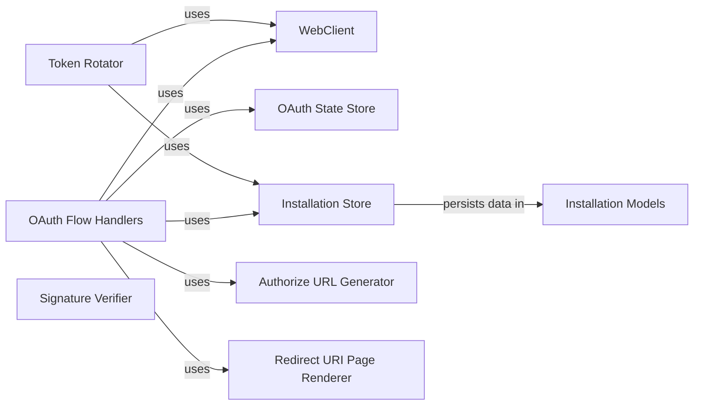

## Component Details

The Authentication and Authorization Manager component handles the OAuth 2.0 flow for authenticating users and installing Slack apps. It manages the generation of authorization URLs, storage of OAuth state, and management of installation data. It supports various storage backends, such as files and databases, providing flexibility for different application environments. This component simplifies the process of integrating Slack apps with user accounts and ensures secure access to Slack resources.

### OAuth Flow Handlers
This component manages the initiation and completion of the OAuth flow. It generates the authorization URL, processes the callback from Slack, exchanges the authorization code for an access token using the WebClient, and manages state using OAuthStateStore. It also handles the rendering of redirect URI pages to inform the user about the outcome of the authorization process.

**Related Classes/Methods**:

- <a href="https://github.com/slackapi/python-slack-sdk/blob/master/integration_tests/samples/token_rotation/oauth_sqlalchemy.py#L203-L211" target="_blank" rel="noopener noreferrer">`python-slack-sdk.integration_tests.samples.token_rotation.oauth_sqlalchemy:oauth_start` (203:211)</a>
- <a href="https://github.com/slackapi/python-slack-sdk/blob/master/integration_tests/samples/token_rotation/oauth_sqlalchemy.py#L215-L277" target="_blank" rel="noopener noreferrer">`python-slack-sdk.integration_tests.samples.token_rotation.oauth_sqlalchemy:oauth_callback` (215:277)</a>
- <a href="https://github.com/slackapi/python-slack-sdk/blob/master/integration_tests/samples/token_rotation/oauth_sqlalchemy.py#L203-L211" target="_blank" rel="noopener noreferrer">`python-slack-sdk.integration_tests.samples.token_rotation.oauth_async:oauth_start` (203:211)</a>
- <a href="https://github.com/slackapi/python-slack-sdk/blob/master/integration_tests/samples/token_rotation/oauth_sqlalchemy.py#L215-L277" target="_blank" rel="noopener noreferrer">`python-slack-sdk.integration_tests.samples.token_rotation.oauth_async:oauth_callback` (215:277)</a>
- <a href="https://github.com/slackapi/python-slack-sdk/blob/master/integration_tests/samples/token_rotation/oauth_sqlalchemy.py#L203-L211" target="_blank" rel="noopener noreferrer">`python-slack-sdk.integration_tests.samples.token_rotation.oauth:oauth_start` (203:211)</a>
- <a href="https://github.com/slackapi/python-slack-sdk/blob/master/integration_tests/samples/token_rotation/oauth_sqlalchemy.py#L215-L277" target="_blank" rel="noopener noreferrer">`python-slack-sdk.integration_tests.samples.token_rotation.oauth:oauth_callback` (215:277)</a>
- <a href="https://github.com/slackapi/python-slack-sdk/blob/master/integration_tests/samples/token_rotation/oauth_sqlalchemy.py#L203-L211" target="_blank" rel="noopener noreferrer">`python-slack-sdk.integration_tests.samples.token_rotation.oauth_sqlite3:oauth_start` (203:211)</a>
- <a href="https://github.com/slackapi/python-slack-sdk/blob/master/integration_tests/samples/token_rotation/oauth_sqlalchemy.py#L215-L277" target="_blank" rel="noopener noreferrer">`python-slack-sdk.integration_tests.samples.token_rotation.oauth_sqlite3:oauth_callback` (215:277)</a>
- <a href="https://github.com/slackapi/python-slack-sdk/blob/master/integration_tests/samples/oauth/oauth_v2.py#L41-L47" target="_blank" rel="noopener noreferrer">`python-slack-sdk.integration_tests.samples.oauth.oauth_v2:oauth_start` (41:47)</a>
- <a href="https://github.com/slackapi/python-slack-sdk/blob/master/integration_tests/samples/oauth/oauth_v2.py#L51-L109" target="_blank" rel="noopener noreferrer">`python-slack-sdk.integration_tests.samples.oauth.oauth_v2:oauth_callback` (51:109)</a>
- <a href="https://github.com/slackapi/python-slack-sdk/blob/master/integration_tests/samples/oauth/oauth_v2.py#L41-L47" target="_blank" rel="noopener noreferrer">`python-slack-sdk.integration_tests.samples.oauth.oauth_v2_async:oauth_start` (41:47)</a>
- <a href="https://github.com/slackapi/python-slack-sdk/blob/master/integration_tests/samples/oauth/oauth_v2.py#L51-L109" target="_blank" rel="noopener noreferrer">`python-slack-sdk.integration_tests.samples.oauth.oauth_v2_async:oauth_callback` (51:109)</a>
- <a href="https://github.com/slackapi/python-slack-sdk/blob/master/integration_tests/samples/openid_connect/flask_example.py#L38-L45" target="_blank" rel="noopener noreferrer">`python-slack-sdk.integration_tests.samples.openid_connect.flask_example:oauth_start` (38:45)</a>
- <a href="https://github.com/slackapi/python-slack-sdk/blob/master/integration_tests/samples/openid_connect/flask_example.py#L49-L94" target="_blank" rel="noopener noreferrer">`python-slack-sdk.integration_tests.samples.openid_connect.flask_example:oauth_callback` (49:94)</a>
- <a href="https://github.com/slackapi/python-slack-sdk/blob/master/integration_tests/samples/openid_connect/flask_example.py#L38-L45" target="_blank" rel="noopener noreferrer">`python-slack-sdk.integration_tests.samples.openid_connect.sanic_example:oauth_start` (38:45)</a>
- <a href="https://github.com/slackapi/python-slack-sdk/blob/master/integration_tests/samples/openid_connect/flask_example.py#L49-L94" target="_blank" rel="noopener noreferrer">`python-slack-sdk.integration_tests.samples.openid_connect.sanic_example:oauth_callback` (49:94)</a>

### WebClient
This component is the Slack Web API client, responsible for making requests to Slack's API endpoints. It's used within the OAuth flow to exchange the authorization code for an access token and to verify the token's validity. It also interacts with views.

**Related Classes/Methods**:

- `slack_sdk.web.client.WebClient` (full file reference)
- `slack_sdk.web.async_client.AsyncWebClient` (full file reference)
- `slack_sdk.web.client.WebClient.oauth_v2_access` (full file reference)
- `slack_sdk.web.async_client.AsyncWebClient.oauth_v2_access` (full file reference)
- `slack_sdk.web.client.WebClient.auth_test` (full file reference)
- `slack_sdk.web.async_client.AsyncWebClient.auth_test` (full file reference)
- `slack_sdk.web.client.WebClient.views_open` (full file reference)
- `slack_sdk.web.async_client.AsyncWebClient.views_open` (full file reference)
- `slack_sdk.web.client.WebClient.openid_connect_token` (full file reference)
- `slack_sdk.web.async_client.AsyncWebClient.openid_connect_token` (full file reference)
- `slack_sdk.web.client.WebClient.openid_connect_userInfo` (full file reference)
- `slack_sdk.web.async_client.AsyncWebClient.openid_connect_userInfo` (full file reference)

### OAuth State Store
This component manages the OAuth state, issuing and consuming state values to prevent CSRF attacks. Different implementations are available, including file-based (FileOAuthStateStore), SQLite-based (SQLite3OAuthStateStore), SQLAlchemy-based and Amazon S3-based stores. It ensures that the callback originates from a legitimate authorization request.

**Related Classes/Methods**:

- <a href="https://github.com/slackapi/python-slack-sdk/blob/master/slack_sdk/oauth/state_store/file/__init__.py#L13-L71" target="_blank" rel="noopener noreferrer">`slack_sdk.oauth.state_store.file.FileOAuthStateStore` (13:71)</a>
- <a href="https://github.com/slackapi/python-slack-sdk/blob/master/slack_sdk/oauth/state_store/sqlite3/__init__.py#L12-L96" target="_blank" rel="noopener noreferrer">`slack_sdk.oauth.state_store.sqlite3.SQLite3OAuthStateStore` (12:96)</a>
- <a href="https://github.com/slackapi/python-slack-sdk/blob/master/slack_sdk/oauth/state_store/sqlalchemy/__init__.py#L15-L80" target="_blank" rel="noopener noreferrer">`slack_sdk.oauth.state_store.sqlalchemy.SQLAlchemyOAuthStateStore` (15:80)</a>
- <a href="https://github.com/slackapi/python-slack-sdk/blob/master/slack_sdk/oauth/state_store/amazon_s3/__init__.py#L12-L69" target="_blank" rel="noopener noreferrer">`slack_sdk.oauth.state_store.amazon_s3.AmazonS3OAuthStateStore` (12:69)</a>
- <a href="https://github.com/slackapi/python-slack-sdk/blob/master/slack_sdk/oauth/state_store/file/__init__.py#L36-L37" target="_blank" rel="noopener noreferrer">`python-slack-sdk.slack_sdk.oauth.state_store.file.FileOAuthStateStore:async_issue` (36:37)</a>
- <a href="https://github.com/slackapi/python-slack-sdk/blob/master/slack_sdk/oauth/state_store/file/__init__.py#L39-L40" target="_blank" rel="noopener noreferrer">`python-slack-sdk.slack_sdk.oauth.state_store.file.FileOAuthStateStore:async_consume` (39:40)</a>
- <a href="https://github.com/slackapi/python-slack-sdk/blob/master/slack_sdk/oauth/state_store/sqlite3/__init__.py#L60-L61" target="_blank" rel="noopener noreferrer">`python-slack-sdk.slack_sdk.oauth.state_store.sqlite3.SQLite3OAuthStateStore:async_issue` (60:61)</a>
- <a href="https://github.com/slackapi/python-slack-sdk/blob/master/slack_sdk/oauth/state_store/sqlite3/__init__.py#L63-L64" target="_blank" rel="noopener noreferrer">`python-slack-sdk.slack_sdk.oauth.state_store.sqlite3.SQLite3OAuthStateStore:async_consume` (63:64)</a>
- <a href="https://github.com/slackapi/python-slack-sdk/blob/master/slack_sdk/oauth/state_store/amazon_s3/__init__.py#L32-L33" target="_blank" rel="noopener noreferrer">`python-slack-sdk.slack_sdk.oauth.state_store.amazon_s3.AmazonS3OAuthStateStore:async_issue` (32:33)</a>
- <a href="https://github.com/slackapi/python-slack-sdk/blob/master/slack_sdk/oauth/state_store/amazon_s3/__init__.py#L35-L36" target="_blank" rel="noopener noreferrer">`python-slack-sdk.slack_sdk.oauth.state_store.amazon_s3.AmazonS3OAuthStateStore:async_consume` (35:36)</a>

### Installation Store
This component persists installation data, including access tokens and bot user IDs. Implementations include file-based (FileInstallationStore), SQLite-based (SQLite3InstallationStore), SQLAlchemy-based (SQLAlchemyInstallationStore) and Amazon S3-based stores. It provides methods to save and retrieve installation information.

**Related Classes/Methods**:

- <a href="https://github.com/slackapi/python-slack-sdk/blob/master/slack_sdk/oauth/installation_store/file/__init__.py#L17-L252" target="_blank" rel="noopener noreferrer">`slack_sdk.oauth.installation_store.file.FileInstallationStore` (17:252)</a>
- <a href="https://github.com/slackapi/python-slack-sdk/blob/master/slack_sdk/oauth/installation_store/sqlite3/__init__.py#L15-L615" target="_blank" rel="noopener noreferrer">`slack_sdk.oauth.installation_store.sqlite3.SQLite3InstallationStore` (15:615)</a>
- <a href="https://github.com/slackapi/python-slack-sdk/blob/master/slack_sdk/oauth/installation_store/sqlalchemy/__init__.py#L28-L375" target="_blank" rel="noopener noreferrer">`slack_sdk.oauth.installation_store.sqlalchemy.SQLAlchemyInstallationStore` (28:375)</a>
- <a href="https://github.com/slackapi/python-slack-sdk/blob/master/slack_sdk/oauth/installation_store/amazon_s3/__init__.py#L17-L351" target="_blank" rel="noopener noreferrer">`slack_sdk.oauth.installation_store.amazon_s3.AmazonS3InstallationStore` (17:351)</a>
- <a href="https://github.com/slackapi/python-slack-sdk/blob/master/slack_sdk/oauth/installation_store/file/__init__.py#L39-L40" target="_blank" rel="noopener noreferrer">`python-slack-sdk.slack_sdk.oauth.installation_store.file.FileInstallationStore:async_save` (39:40)</a>
- <a href="https://github.com/slackapi/python-slack-sdk/blob/master/slack_sdk/oauth/installation_store/file/__init__.py#L103-L114" target="_blank" rel="noopener noreferrer">`python-slack-sdk.slack_sdk.oauth.installation_store.file.FileInstallationStore:async_find_bot` (103:114)</a>
- <a href="https://github.com/slackapi/python-slack-sdk/blob/master/slack_sdk/oauth/installation_store/file/__init__.py#L138-L151" target="_blank" rel="noopener noreferrer">`python-slack-sdk.slack_sdk.oauth.installation_store.file.FileInstallationStore:async_find_installation` (138:151)</a>
- <a href="https://github.com/slackapi/python-slack-sdk/blob/master/slack_sdk/oauth/installation_store/sqlite3/__init__.py#L128-L129" target="_blank" rel="noopener noreferrer">`python-slack-sdk.slack_sdk.oauth.installation_store.sqlite3.SQLite3InstallationStore:async_save` (128:129)</a>
- <a href="https://github.com/slackapi/python-slack-sdk/blob/master/slack_sdk/oauth/installation_store/sqlite3/__init__.py#L284-L295" target="_blank" rel="noopener noreferrer">`python-slack-sdk.slack_sdk.oauth.installation_store.sqlite3.SQLite3InstallationStore:async_find_bot` (284:295)</a>
- <a href="https://github.com/slackapi/python-slack-sdk/blob/master/slack_sdk/oauth/installation_store/sqlite3/__init__.py#L368-L381" target="_blank" rel="noopener noreferrer">`python-slack-sdk.slack_sdk.oauth.installation_store.sqlite3.SQLite3InstallationStore:async_find_installation` (368:381)</a>
- <a href="https://github.com/slackapi/python-slack-sdk/blob/master/slack_sdk/oauth/installation_store/amazon_s3/__init__.py#L39-L40" target="_blank" rel="noopener noreferrer">`python-slack-sdk.slack_sdk.oauth.installation_store.amazon_s3.AmazonS3InstallationStore:async_save` (39:40)</a>
- <a href="https://github.com/slackapi/python-slack-sdk/blob/master/slack_sdk/oauth/installation_store/amazon_s3/__init__.py#L142-L153" target="_blank" rel="noopener noreferrer">`python-slack-sdk.slack_sdk.oauth.installation_store.amazon_s3.AmazonS3InstallationStore:async_find_bot` (142:153)</a>
- <a href="https://github.com/slackapi/python-slack-sdk/blob/master/slack_sdk/oauth/installation_store/amazon_s3/__init__.py#L182-L195" target="_blank" rel="noopener noreferrer">`python-slack-sdk.slack_sdk.oauth.installation_store.amazon_s3.AmazonS3InstallationStore:async_find_installation` (182:195)</a>

### Token Rotator
This component handles the rotation of tokens, refreshing them when they are about to expire. It uses the WebClient to communicate with the Slack API and the InstallationStore to persist the updated tokens. It supports both bot and user token rotation.

**Related Classes/Methods**:

- `slack_sdk.oauth.token_rotation.rotator.TokenRotator` (full file reference)
- `slack_sdk.oauth.token_rotation.async_rotator.AsyncTokenRotator` (full file reference)
- <a href="https://github.com/slackapi/python-slack-sdk/blob/master/slack_sdk/oauth/token_rotation/rotator.py#L19-L56" target="_blank" rel="noopener noreferrer">`python-slack-sdk.slack_sdk.oauth.token_rotation.rotator.TokenRotator:perform_token_rotation` (19:56)</a>
- `python-slack-sdk.slack_sdk.oauth.token_rotation.async_rotator.AsyncTokenRotator:perform_token_rotation` (full file reference)

### Authorize URL Generator
This component generates the authorization URL that the user is redirected to in order to authorize the application. It uses the OpenIDConnectAuthorizeUrlGenerator for OpenID Connect flows and the standard AuthorizeUrlGenerator for OAuth V2 flows.

**Related Classes/Methods**:

- `slack_sdk.oauth.authorize_url_generator.AuthorizeUrlGenerator` (full file reference)
- `slack_sdk.oauth.authorize_url_generator.OpenIDConnectAuthorizeUrlGenerator` (full file reference)

### Installation Models
These components define the data models for representing installations (Installation) and bots (Bot). They encapsulate the information stored in the InstallationStore and provide methods for converting the data to and from dictionaries.

**Related Classes/Methods**:

- <a href="https://github.com/slackapi/python-slack-sdk/blob/master/slack_sdk/oauth/installation_store/models/installation.py#L9-L200" target="_blank" rel="noopener noreferrer">`slack_sdk.oauth.installation_store.models.installation.Installation` (9:200)</a>
- `slack_sdk.oauth.installation_store.models.bot.Bot` (full file reference)

### Signature Verifier
This component verifies the signatures of incoming requests to ensure that they are coming from Slack. It is used to validate the authenticity of the requests received by the Slack app.

**Related Classes/Methods**:

- `slack_sdk.signature.SignatureVerifier` (full file reference)

### Redirect URI Page Renderer
This component renders the success or failure page after the OAuth flow is completed. It provides a user-friendly interface to inform the user about the outcome of the authorization process.

**Related Classes/Methods**:

- `slack_sdk.oauth.redirect_uri_page_renderer.RedirectUriPageRenderer` (full file reference)