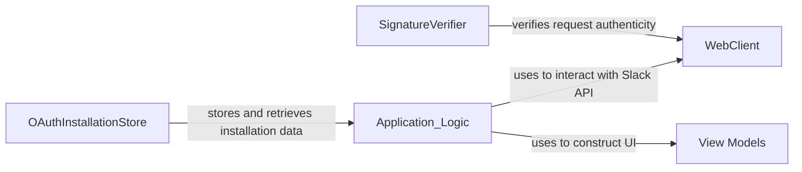

## Component Details

This system ensures secure communication with Slack by verifying the authenticity and integrity of incoming requests. It uses a signature verification mechanism to prevent unauthorized access and tampering. The system also provides functionalities for interacting with the Slack Web API, managing OAuth installations, and constructing user interfaces using view models. The core components include SignatureVerifier, WebClient, OAuthInstallationStore, and View Models, which work together to handle requests, manage authentication, and present information to users.

### SignatureVerifier
This component is responsible for verifying the authenticity of requests sent to the Slack application by validating the request signature. It ensures that the request hasn't been tampered with and originates from Slack.

**Related Classes/Methods**:

- <a href="https://github.com/slackapi/python-slack-sdk/blob/master/tests/slack_sdk/signature/__init__.py#L24-L114" target="_blank" rel="noopener noreferrer">`slack_sdk.signature.SignatureVerifier` (24:114)</a>
- <a href="https://github.com/slackapi/python-slack-sdk/blob/master/tests/slack_sdk/signature/__init__.py#L74-L90" target="_blank" rel="noopener noreferrer">`slack_sdk.signature.SignatureVerifier.is_valid` (74:90)</a>
- <a href="https://github.com/slackapi/python-slack-sdk/blob/master/tests/slack_sdk/signature/__init__.py#L92-L113" target="_blank" rel="noopener noreferrer">`slack_sdk.signature.SignatureVerifier.is_valid_request` (92:113)</a>
- <a href="https://github.com/slackapi/python-slack-sdk/blob/master/tests/slack_sdk/signature/__init__.py#L28-L39" target="_blank" rel="noopener noreferrer">`slack_sdk.signature.SignatureVerifier.__init__` (28:39)</a>

### WebClient
This component provides methods for interacting with the Slack Web API. It allows the application to send requests to Slack, such as opening views, completing workflows, and retrieving information. It supports both synchronous and asynchronous operations.

**Related Classes/Methods**:

- <a href="https://github.com/slackapi/python-slack-sdk/blob/master/tests/slack_sdk/web/test_legacy_web_client_url_format.py#L60-L1149" target="_blank" rel="noopener noreferrer">`slack_sdk.web.client.WebClient` (60:1149)</a>
- `slack_sdk.web.client.WebClient.views_open` (444:459)
- `slack_sdk.web.client.WebClient.apps_event_authorizations_list` (909:924)
- `slack_sdk.web.client.WebClient.workflows_stepCompleted` (1044:1059)
- `slack_sdk.web.client.WebClient.workflows_stepFailed` (1061:1076)
- `slack_sdk.web.client.WebClient.workflows_updateStep` (1078:1093)
- <a href="https://github.com/slackapi/python-slack-sdk/blob/master/tests/slack_sdk/web/test_legacy_web_client_url_format.py#L48-L1098" target="_blank" rel="noopener noreferrer">`slack_sdk.web.async_client.AsyncWebClient` (48:1098)</a>
- `slack_sdk.web.async_client.AsyncWebClient.views_open` (319:334)

### OAuthInstallationStore
This component is responsible for storing and retrieving OAuth installation information, such as access tokens and bot user IDs. It provides different storage implementations, including file-based and database-backed stores, to persist installation data.

**Related Classes/Methods**:

- <a href="https://github.com/slackapi/python-slack-sdk/blob/master/slack_sdk/oauth/installation_store/file/__init__.py#L116-L136" target="_blank" rel="noopener noreferrer">`slack_sdk.oauth.installation_store.file.FileInstallationStore.find_bot` (116:136)</a>
- <a href="https://github.com/slackapi/python-slack-sdk/blob/master/slack_sdk/oauth/installation_store/sqlalchemy/__init__.py#L197-L226" target="_blank" rel="noopener noreferrer">`slack_sdk.oauth.installation_store.sqlalchemy.SQLAlchemyInstallationStore.find_bot` (197:226)</a>
- <a href="https://github.com/slackapi/python-slack-sdk/blob/master/slack_sdk/oauth/installation_store/sqlite3/__init__.py#L297-L366" target="_blank" rel="noopener noreferrer">`slack_sdk.oauth.installation_store.sqlite3.SQLite3InstallationStore.find_bot` (297:366)</a>
- <a href="https://github.com/slackapi/python-slack-sdk/blob/master/slack_sdk/oauth/installation_store/file/__init__.py#L103-L114" target="_blank" rel="noopener noreferrer">`slack_sdk.oauth.installation_store.file.FileInstallationStore.async_find_bot` (103:114)</a>

### View Models
This component defines data models for representing Slack views, including blocks and elements. It provides a way to structure and serialize view data for use with the Web API when constructing user interfaces.

**Related Classes/Methods**:

- <a href="https://github.com/slackapi/python-slack-sdk/blob/master/slack_sdk/models/views/__init__.py#L9-L126" target="_blank" rel="noopener noreferrer">`slack_sdk.models.views.View` (9:126)</a>
- <a href="https://github.com/slackapi/python-slack-sdk/blob/master/slack_sdk/models/blocks/block_elements.py#L15-L54" target="_blank" rel="noopener noreferrer">`slack_sdk.models.blocks.basic_components.PlainTextObject` (15:54)</a>
- <a href="https://github.com/slackapi/python-slack-sdk/blob/master/slack_sdk/models/blocks/block_elements.py#L131-L178" target="_blank" rel="noopener noreferrer">`slack_sdk.models.blocks.blocks.InputBlock` (131:178)</a>
- <a href="https://github.com/slackapi/python-slack-sdk/blob/master/slack_sdk/models/blocks/block_elements.py#L1383-L1449" target="_blank" rel="noopener noreferrer">`slack_sdk.models.blocks.block_elements.PlainTextInputElement` (1383:1449)</a>
- <a href="https://github.com/slackapi/python-slack-sdk/blob/master/slack_sdk/models/blocks/block_elements.py#L23-L78" target="_blank" rel="noopener noreferrer">`slack_sdk.models.blocks.blocks.SectionBlock` (23:78)</a>
- `slack_sdk.models.basic_objects.JsonObject.to_dict` (21:24)