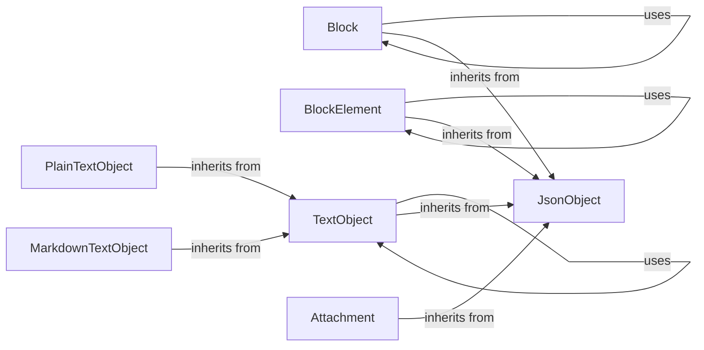

## Component Details

The Data Model Definitions component provides a structured way to represent Slack's data entities in Python. It encompasses a set of classes that model various Slack objects like messages, blocks, attachments, and views. These models inherit from a base `JsonObject` class, which provides common functionalities such as converting objects to dictionaries and validating JSON. The component ensures type safety and consistency when interacting with the Slack API, simplifying the process of creating, manipulating, and parsing Slack data.

### JsonObject
Base class for data models, providing common functionality for converting objects to dictionaries, validating JSON, and handling attributes. It serves as the foundation for all other data models in the Slack SDK.

**Related Classes/Methods**:

- `slack_sdk.models.basic_objects.JsonObject.to_dict` (full file reference)
- `slack_sdk.models.basic_objects.JsonObject.validate_json` (full file reference)
- `slack_sdk.models.basic_objects.JsonObject.get_non_null_attributes` (full file reference)
- `slack_sdk.models.basic_objects.JsonObject` (full file reference)

### Block
Abstract class representing a Block in the Slack Block Kit. Defines the basic structure and parsing logic for different types of blocks. It provides a common interface for working with various block types.

**Related Classes/Methods**:

- `slack_sdk.models.blocks.blocks.Block.parse` (full file reference)
- `slack_sdk.models.blocks.blocks.Block.parse_all` (full file reference)
- `slack_sdk.models.blocks.blocks.Block` (full file reference)

### BlockElement
Abstract class representing a Block Element in the Slack Block Kit. Defines the basic structure and parsing logic for different types of block elements. It serves as a base for creating interactive components within blocks.

**Related Classes/Methods**:

- `slack_sdk.models.blocks.block_elements.BlockElement.parse` (full file reference)
- `slack_sdk.models.blocks.block_elements.BlockElement.parse_all` (full file reference)
- <a href="https://github.com/slackapi/python-slack-sdk/blob/master/slack_sdk/models/blocks/block_elements.py#L29-L90" target="_blank" rel="noopener noreferrer">`slack_sdk.models.blocks.block_elements.BlockElement` (29:90)</a>

### TextObject
Abstract class representing a Text Object in the Slack Block Kit. Defines the basic structure and parsing logic for different types of text objects. It's the parent class for `PlainTextObject` and `MarkdownTextObject`.

**Related Classes/Methods**:

- `slack_sdk.models.blocks.basic_components.TextObject.parse` (full file reference)
- `slack_sdk.models.blocks.basic_components.TextObject` (full file reference)

### PlainTextObject
Class representing a Plain Text Object in the Slack Block Kit. Used to display plain text in blocks and other components. It inherits from `TextObject`.

**Related Classes/Methods**:

- `slack_sdk.models.blocks.basic_components.PlainTextObject` (full file reference)
- `slack_sdk.models.blocks.basic_components.PlainTextObject.from_str` (full file reference)

### MarkdownTextObject
Class representing a Markdown Text Object in the Slack Block Kit. Used to display formatted text using Markdown in blocks and other components. It inherits from `TextObject`.

**Related Classes/Methods**:

- `slack_sdk.models.blocks.basic_components.MarkdownTextObject` (full file reference)
- `slack_sdk.models.blocks.basic_components.MarkdownTextObject.from_str` (full file reference)
- `slack_sdk.models.blocks.basic_components.MarkdownTextObject.from_link` (full file reference)

### Attachment
Class representing an Attachment in a Slack message. Allows adding structured data and interactive elements to messages. It provides a way to enhance messages with additional context and functionality.

**Related Classes/Methods**:

- <a href="https://github.com/slackapi/python-slack-sdk/blob/master/slack_sdk/models/attachments/__init__.py#L420-L426" target="_blank" rel="noopener noreferrer">`slack_sdk.models.attachments.Attachment.to_dict` (420:426)</a>
- <a href="https://github.com/slackapi/python-slack-sdk/blob/master/slack_sdk/models/attachments/__init__.py#L264-L426" target="_blank" rel="noopener noreferrer">`slack_sdk.models.attachments.Attachment` (264:426)</a>