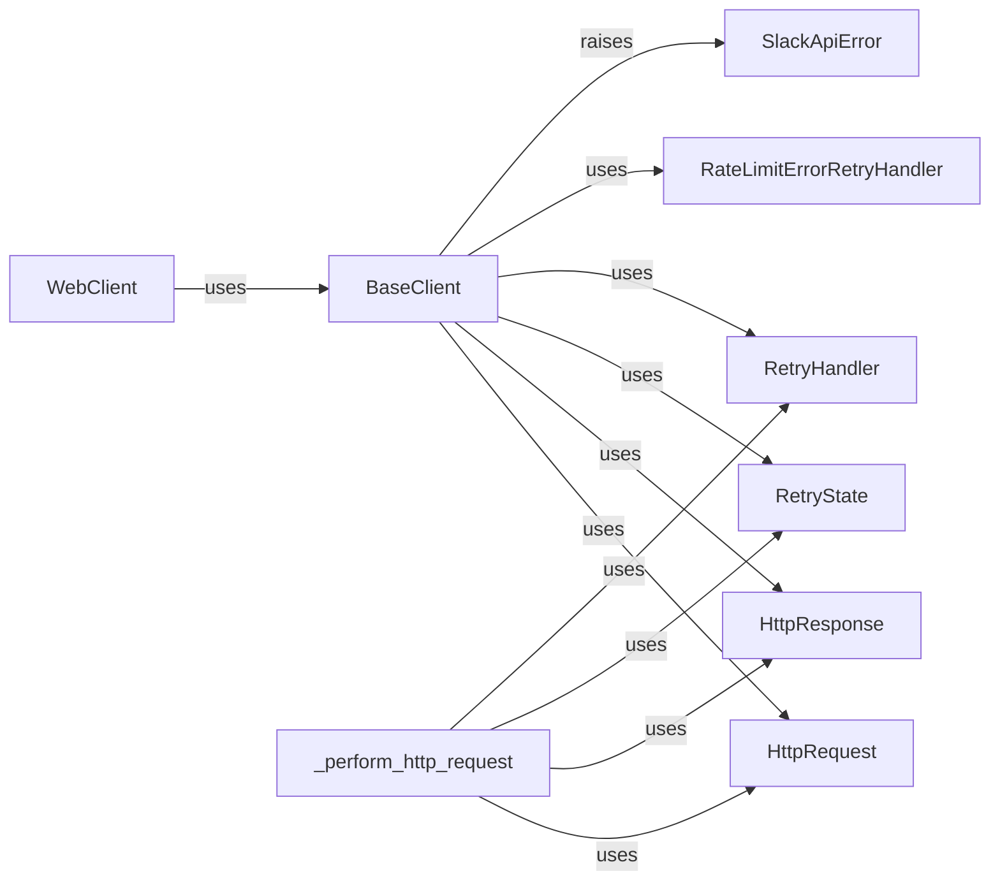

## Component Details

The HTTP Request Management component provides functionalities for managing HTTP requests to the Slack API, including automatic retries and proxy support. It improves the reliability of Slack API interactions by automatically handling transient errors, rate limits, and network issues. It encapsulates the logic for sending HTTP requests and handling responses, providing a consistent interface for other components to interact with Slack's APIs. The core of this component lies in the `RetryHandler` and its implementations, which determine whether a request should be retried based on the response and the current retry state.

### WebClient
The WebClient offers a high-level interface for interacting with the Slack Web API. It simplifies request creation, response parsing, and error management, leveraging the retry mechanism to handle rate limits and other temporary issues, ensuring reliable communication with Slack's web services.

**Related Classes/Methods**:

- `slack_sdk.web.client.WebClient` (full file reference)
- `slack_sdk.web.async_client.AsyncWebClient` (full file reference)

### BaseClient
The BaseClient serves as the foundation for all API clients, providing core functionality for handling HTTP requests and implementing retry logic. It encapsulates the underlying HTTP request mechanisms, manages retry states, and integrates with retry handlers to ensure reliable communication with Slack's APIs.

**Related Classes/Methods**:

- `slack_sdk.web.base_client.BaseClient` (full file reference)

### HttpRequest
The HttpRequest class encapsulates the details of an HTTP request, including the URL, headers, and body. It provides a structured representation of the request that can be used by the retry mechanism to resend requests if necessary.

**Related Classes/Methods**:

- `slack_sdk.http_retry.request.HttpRequest` (full file reference)

### HttpResponse
The HttpResponse class encapsulates the details of an HTTP response, including the status code, headers, and body. It allows the retry mechanism to determine whether a request should be retried based on the response received from the Slack API.

**Related Classes/Methods**:

- `slack_sdk.http_retry.response.HttpResponse` (full file reference)

### RetryState
The RetryState class tracks the state of a retry operation, including the number of attempts made and the delay between attempts. It is used by the retry mechanism to manage the retry process and ensure that requests are not retried indefinitely.

**Related Classes/Methods**:

- `slack_sdk.http_retry.state.RetryState` (full file reference)

### RetryHandler
The RetryHandler class defines the interface for retry handlers, which determine whether a request should be retried based on the response. It provides methods for checking if a retry is possible and for preparing for the next attempt. Concrete implementations, like RateLimitErrorRetryHandler, implement specific retry strategies.

**Related Classes/Methods**:

- `slack_sdk.http_retry.handler.RetryHandler` (full file reference)
- `slack_sdk.http_retry.async_handler.AsyncRetryHandler` (full file reference)

### RateLimitErrorRetryHandler
The RateLimitErrorRetryHandler is a specialized retry handler that retries requests that fail due to rate limiting errors. It extracts the retry-after header from the response and uses it to determine the delay before the next attempt, ensuring that the application respects Slack's rate limits.

**Related Classes/Methods**:

- `slack_sdk.http_retry.builtin_handlers.RateLimitErrorRetryHandler` (full file reference)
- `slack_sdk.http_retry.builtin_async_handlers.AsyncRateLimitErrorRetryHandler` (full file reference)

### SlackApiError
The SlackApiError exception is raised when the Slack API returns an error. It contains information about the error, such as the error code and message, allowing applications to handle API errors gracefully.

**Related Classes/Methods**:

- <a href="https://github.com/slackapi/python-slack-sdk/blob/master/slack_sdk/errors/__init__.py#L18-L33" target="_blank" rel="noopener noreferrer">`slack_sdk.errors.SlackApiError` (18:33)</a>

### _perform_http_request
This function is responsible for making the actual HTTP request to the Slack API, handling any necessary retries, and returning the response. It encapsulates the core logic for sending requests and receiving responses, including the retry mechanism.

**Related Classes/Methods**:

- `slack_sdk.scim.v1.client.SCIMClient:_perform_http_request` (full file reference)
- `slack_sdk.scim.v1.async_client.AsyncSCIMClient:_perform_http_request` (full file reference)
- `slack_sdk.webhook.client.WebhookClient:_perform_http_request` (full file reference)
- `slack_sdk.webhook.async_client.AsyncWebhookClient:_perform_http_request` (full file reference)
- `slack_sdk.audit_logs.v1.client.AuditLogsClient:_perform_http_request` (full file reference)
- <a href="https://github.com/slackapi/python-slack-sdk/blob/master/slack_sdk/audit_logs/v1/async_client.py#L219-L361" target="_blank" rel="noopener noreferrer">`slack_sdk.audit_logs.v1.async_client.AsyncAuditLogsClient:_perform_http_request` (219:361)</a>