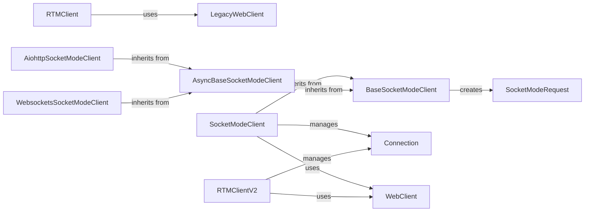

## Component Details

The Real-time Interaction Handler component provides the functionality to interact with Slack's Real Time Messaging (RTM) API and Socket Mode. It manages WebSocket connections, sends and receives messages, and dispatches events to registered listeners. The component supports both the legacy RTM API through the RTMClient and the newer Socket Mode through the SocketModeClient, offering flexibility in how applications receive real-time updates from Slack and respond to user interactions. It handles connection lifecycle, message processing, and event dispatching, ensuring seamless real-time communication with Slack.

### RTMClient
The RTMClient manages communication with Slack's Real Time Messaging (RTM) API. It establishes a WebSocket connection, sends and receives messages, and dispatches events to registered listeners. It uses the LegacyWebClient to retrieve WebSocket information and provides methods for sending messages, pinging the server, and managing the connection.

**Related Classes/Methods**:

- <a href="https://github.com/slackapi/python-slack-sdk/blob/master/slack_sdk/rtm/__init__.py#L26-L570" target="_blank" rel="noopener noreferrer">`slack_sdk.rtm.RTMClient` (26:570)</a>
- <a href="https://github.com/slackapi/python-slack-sdk/blob/master/slack_sdk/rtm/__init__.py#L163-L184" target="_blank" rel="noopener noreferrer">`slack_sdk.rtm.RTMClient.on` (163:184)</a>
- <a href="https://github.com/slackapi/python-slack-sdk/blob/master/slack_sdk/rtm/__init__.py#L186-L211" target="_blank" rel="noopener noreferrer">`slack_sdk.rtm.RTMClient.start` (186:211)</a>
- <a href="https://github.com/slackapi/python-slack-sdk/blob/master/slack_sdk/rtm/__init__.py#L213-L224" target="_blank" rel="noopener noreferrer">`slack_sdk.rtm.RTMClient.stop` (213:224)</a>
- <a href="https://github.com/slackapi/python-slack-sdk/blob/master/slack_sdk/rtm/__init__.py#L153-L160" target="_blank" rel="noopener noreferrer">`slack_sdk.rtm.RTMClient.run_on` (153:160)</a>
- <a href="https://github.com/slackapi/python-slack-sdk/blob/master/slack_sdk/rtm/__init__.py#L234-L258" target="_blank" rel="noopener noreferrer">`slack_sdk.rtm.RTMClient.send_over_websocket` (234:258)</a>
- <a href="https://github.com/slackapi/python-slack-sdk/blob/master/slack_sdk/rtm/__init__.py#L268-L278" target="_blank" rel="noopener noreferrer">`slack_sdk.rtm.RTMClient.ping` (268:278)</a>
- <a href="https://github.com/slackapi/python-slack-sdk/blob/master/slack_sdk/rtm/__init__.py#L280-L293" target="_blank" rel="noopener noreferrer">`slack_sdk.rtm.RTMClient.typing` (280:293)</a>
- <a href="https://github.com/slackapi/python-slack-sdk/blob/master/slack_sdk/rtm/__init__.py#L329-L382" target="_blank" rel="noopener noreferrer">`slack_sdk.rtm.RTMClient._connect_and_read` (329:382)</a>
- <a href="https://github.com/slackapi/python-slack-sdk/blob/master/slack_sdk/rtm/__init__.py#L384-L434" target="_blank" rel="noopener noreferrer">`slack_sdk.rtm.RTMClient._read_messages` (384:434)</a>
- <a href="https://github.com/slackapi/python-slack-sdk/blob/master/slack_sdk/rtm/__init__.py#L436-L489" target="_blank" rel="noopener noreferrer">`slack_sdk.rtm.RTMClient._dispatch_event` (436:489)</a>
- <a href="https://github.com/slackapi/python-slack-sdk/blob/master/slack_sdk/rtm/__init__.py#L491-L541" target="_blank" rel="noopener noreferrer">`slack_sdk.rtm.RTMClient._retrieve_websocket_info` (491:541)</a>
- <a href="https://github.com/slackapi/python-slack-sdk/blob/master/slack_sdk/rtm/__init__.py#L560-L570" target="_blank" rel="noopener noreferrer">`slack_sdk.rtm.RTMClient._close_websocket` (560:570)</a>
- <a href="https://github.com/slackapi/python-slack-sdk/blob/master/slack_sdk/rtm/__init__.py#L107-L150" target="_blank" rel="noopener noreferrer">`slack_sdk.rtm.RTMClient.__init__` (107:150)</a>

### LegacyWebClient
The LegacyWebClient is used by the RTMClient to interact with Slack's Web API. Specifically, it's used to call `rtm_start` or `rtm_connect` to obtain the WebSocket URL for the RTM connection. It provides methods for various Slack API calls, including sending messages and reacting to messages.

**Related Classes/Methods**:

- <a href="https://github.com/slackapi/python-slack-sdk/blob/master/tests/slack_sdk/web/test_legacy_web_client_url_format.py#L20-L507" target="_blank" rel="noopener noreferrer">`slack_sdk.web.legacy_client.LegacyWebClient` (20:507)</a>
- `slack_sdk.web.legacy_client.LegacyWebClient.rtm_start` (394:400)
- `slack_sdk.web.legacy_client.LegacyWebClient.rtm_connect` (402:408)
- `slack_sdk.web.legacy_client.LegacyWebClient.chat_postMessage` (128:134)

### SocketModeClient
The SocketModeClient establishes a WebSocket connection with Slack using the Socket Mode protocol. It handles sending and receiving messages, managing the connection state, and dispatching events. It uses a `WebClient` for initial handshake and configuration and relies on internal components for connection management and message processing.

**Related Classes/Methods**:

- <a href="https://github.com/slackapi/python-slack-sdk/blob/master/tests/slack_sdk/socket_mode/test_websocket_client.py#L31-L169" target="_blank" rel="noopener noreferrer">`slack_sdk.socket_mode.client.BaseSocketModeClient` (31:169)</a>
- <a href="https://github.com/slackapi/python-slack-sdk/blob/master/slack_sdk/socket_mode/builtin/internals.py#L24-L244" target="_blank" rel="noopener noreferrer">`slack_sdk.socket_mode.builtin.client.SocketModeClient` (24:244)</a>
- `slack_sdk.socket_mode.builtin.client.SocketModeClient.connect` (64:70)
- `slack_sdk.socket_mode.builtin.client.SocketModeClient.disconnect` (72:75)
- `slack_sdk.socket_mode.builtin.client.SocketModeClient.send_message` (77:80)
- `slack_sdk.socket_mode.builtin.client.SocketModeClient.close` (82:85)
- `slack_sdk.socket_mode.builtin.client.SocketModeClient._on_message` (104:140)
- `slack_sdk.socket_mode.builtin.client.SocketModeClient.__init__` (33:49)
- `slack_sdk.socket_mode.builtin.client.SocketModeClient.is_connected` (51:54)

### AsyncBaseSocketModeClient
The AsyncBaseSocketModeClient provides an asynchronous base class for Socket Mode clients. It manages the WebSocket connection, sends and receives messages, and processes events asynchronously. It includes functionalities for connecting, disconnecting, sending responses, and running message listeners.

**Related Classes/Methods**:

- <a href="https://github.com/slackapi/python-slack-sdk/blob/master/tests/slack_sdk/socket_mode/test_websocket_client.py#L25-L203" target="_blank" rel="noopener noreferrer">`slack_sdk.socket_mode.async_client.AsyncBaseSocketModeClient` (25:203)</a>
- `slack_sdk.socket_mode.async_client.AsyncBaseSocketModeClient.connect_to_new_endpoint` (59:74)
- `slack_sdk.socket_mode.async_client.AsyncBaseSocketModeClient.close` (76:80)
- `slack_sdk.socket_mode.async_client.AsyncBaseSocketModeClient.send_socket_mode_response` (82:90)
- `slack_sdk.socket_mode.async_client.AsyncBaseSocketModeClient.process_messages` (92:120)
- `slack_sdk.socket_mode.async_client.AsyncBaseSocketModeClient.process_message` (122:148)
- `slack_sdk.socket_mode.async_client.AsyncBaseSocketModeClient.run_message_listeners` (150:163)

### BaseSocketModeClient
The BaseSocketModeClient serves as a base class for Socket Mode clients, providing common functionalities for managing WebSocket connections and processing messages. It defines methods for connecting, disconnecting, sending responses, and running message listeners. It is inherited by both synchronous and asynchronous Socket Mode client implementations.

**Related Classes/Methods**:

- <a href="https://github.com/slackapi/python-slack-sdk/blob/master/tests/slack_sdk/socket_mode/test_websocket_client.py#L31-L169" target="_blank" rel="noopener noreferrer">`slack_sdk.socket_mode.client.BaseSocketModeClient` (31:169)</a>
- `slack_sdk.socket_mode.client.BaseSocketModeClient.connect_to_new_endpoint` (65:80)
- `slack_sdk.socket_mode.client.BaseSocketModeClient.close` (82:86)
- `slack_sdk.socket_mode.client.BaseSocketModeClient.send_socket_mode_response` (88:96)
- `slack_sdk.socket_mode.client.BaseSocketModeClient.process_message` (114:140)
- `slack_sdk.socket_mode.client.BaseSocketModeClient.run_message_listeners` (142:155)
- `slack_sdk.socket_mode.client.BaseSocketModeClient.process_messages` (98:112)

### Connection
The Connection class manages the WebSocket connection for Socket Mode clients. It handles establishing the connection, sending and receiving data, and closing the connection. It uses internal functions for establishing the socket connection and parsing responses.

**Related Classes/Methods**:

- <a href="https://github.com/slackapi/python-slack-sdk/blob/master/slack_sdk/socket_mode/builtin/internals.py#L22-L181" target="_blank" rel="noopener noreferrer">`slack_sdk.socket_mode.builtin.connection.Connection` (22:181)</a>
- `slack_sdk.socket_mode.builtin.connection.Connection.connect` (48:68)
- `slack_sdk.socket_mode.builtin.connection.Connection.close` (70:73)
- `slack_sdk.socket_mode.builtin.connection.Connection.send` (75:81)
- `slack_sdk.socket_mode.builtin.connection.Connection.is_active` (83:86)
- `slack_sdk.socket_mode.builtin.connection.Connection.disconnect` (88:91)
- `slack_sdk.socket_mode.builtin.connection.Connection.run_until_completion` (93:179)
- `slack_sdk.socket_mode.builtin.connection.Connection.check_state` (40:46)

### RTMClientV2
The RTMClientV2 is a newer version of the RTM client that uses Socket Mode under the hood. It manages a persistent connection to Slack's RTM API, handling message sending, receiving, and event processing. It utilizes a `WebClient` for API calls and manages connection state using internal components.

**Related Classes/Methods**:

- <a href="https://github.com/slackapi/python-slack-sdk/blob/master/tests/slack_sdk/rtm_v2/test_rtm_v2.py#L25-L348" target="_blank" rel="noopener noreferrer">`slack_sdk.rtm_v2.RTMClient` (25:348)</a>
- <a href="https://github.com/slackapi/python-slack-sdk/blob/master/tests/slack_sdk/rtm_v2/test_rtm_v2.py#L44-L64" target="_blank" rel="noopener noreferrer">`slack_sdk.rtm_v2.RTMClient.__init__` (44:64)</a>
- <a href="https://github.com/slackapi/python-slack-sdk/blob/master/tests/slack_sdk/rtm_v2/test_rtm_v2.py#L66-L75" target="_blank" rel="noopener noreferrer">`slack_sdk.rtm_v2.RTMClient.on` (66:75)</a>
- <a href="https://github.com/slackapi/python-slack-sdk/blob/master/tests/slack_sdk/rtm_v2/test_rtm_v2.py#L77-L80" target="_blank" rel="noopener noreferrer">`slack_sdk.rtm_v2.RTMClient.is_connected` (77:80)</a>
- <a href="https://github.com/slackapi/python-slack-sdk/blob/master/tests/slack_sdk/rtm_v2/test_rtm_v2.py#L82-L90" target="_blank" rel="noopener noreferrer">`slack_sdk.rtm_v2.RTMClient.issue_new_wss_url` (82:90)</a>
- <a href="https://github.com/slackapi/python-slack-sdk/blob/master/tests/slack_sdk/rtm_v2/test_rtm_v2.py#L92-L107" target="_blank" rel="noopener noreferrer">`slack_sdk.rtm_v2.RTMClient.connect_to_new_endpoint` (92:107)</a>
- <a href="https://github.com/slackapi/python-slack-sdk/blob/master/tests/slack_sdk/rtm_v2/test_rtm_v2.py#L109-L112" target="_blank" rel="noopener noreferrer">`slack_sdk.rtm_v2.RTMClient.connect` (109:112)</a>
- <a href="https://github.com/slackapi/python-slack-sdk/blob/master/tests/slack_sdk/rtm_v2/test_rtm_v2.py#L114-L117" target="_blank" rel="noopener noreferrer">`slack_sdk.rtm_v2.RTMClient.disconnect` (114:117)</a>
- <a href="https://github.com/slackapi/python-slack-sdk/blob/master/tests/slack_sdk/rtm_v2/test_rtm_v2.py#L119-L122" target="_blank" rel="noopener noreferrer">`slack_sdk.rtm_v2.RTMClient.close` (119:122)</a>
- <a href="https://github.com/slackapi/python-slack-sdk/blob/master/tests/slack_sdk/rtm_v2/test_rtm_v2.py#L124-L127" target="_blank" rel="noopener noreferrer">`slack_sdk.rtm_v2.RTMClient.start` (124:127)</a>
- <a href="https://github.com/slackapi/python-slack-sdk/blob/master/tests/slack_sdk/rtm_v2/test_rtm_v2.py#L129-L132" target="_blank" rel="noopener noreferrer">`slack_sdk.rtm_v2.RTMClient.send` (129:132)</a>
- <a href="https://github.com/slackapi/python-slack-sdk/blob/master/tests/slack_sdk/rtm_v2/test_rtm_v2.py#L134-L160" target="_blank" rel="noopener noreferrer">`slack_sdk.rtm_v2.RTMClient.process_message` (134:160)</a>
- <a href="https://github.com/slackapi/python-slack-sdk/blob/master/tests/slack_sdk/rtm_v2/test_rtm_v2.py#L162-L190" target="_blank" rel="noopener noreferrer">`slack_sdk.rtm_v2.RTMClient.process_messages` (162:190)</a>
- <a href="https://github.com/slackapi/python-slack-sdk/blob/master/tests/slack_sdk/rtm_v2/test_rtm_v2.py#L192-L205" target="_blank" rel="noopener noreferrer">`slack_sdk.rtm_v2.RTMClient.run_message_listeners` (192:205)</a>
- <a href="https://github.com/slackapi/python-slack-sdk/blob/master/tests/slack_sdk/rtm_v2/test_rtm_v2.py#L207-L220" target="_blank" rel="noopener noreferrer">`slack_sdk.rtm_v2.RTMClient.run_all_message_listeners` (207:220)</a>
- <a href="https://github.com/slackapi/python-slack-sdk/blob/master/tests/slack_sdk/rtm_v2/test_rtm_v2.py#L222-L235" target="_blank" rel="noopener noreferrer">`slack_sdk.rtm_v2.RTMClient.run_all_error_listeners` (222:235)</a>
- <a href="https://github.com/slackapi/python-slack-sdk/blob/master/tests/slack_sdk/rtm_v2/test_rtm_v2.py#L237-L250" target="_blank" rel="noopener noreferrer">`slack_sdk.rtm_v2.RTMClient.run_all_close_listeners` (237:250)</a>
- <a href="https://github.com/slackapi/python-slack-sdk/blob/master/tests/slack_sdk/rtm_v2/test_rtm_v2.py#L252-L324" target="_blank" rel="noopener noreferrer">`slack_sdk.rtm_v2.RTMClient._run_current_session` (252:324)</a>
- <a href="https://github.com/slackapi/python-slack-sdk/blob/master/tests/slack_sdk/rtm_v2/test_rtm_v2.py#L326-L347" target="_blank" rel="noopener noreferrer">`slack_sdk.rtm_v2.RTMClient._monitor_current_session` (326:347)</a>

### WebClient
The WebClient provides a general interface for interacting with Slack's Web API. It's used for various operations, such as posting messages, adding reactions, and retrieving information. It is used by both RTMClientV2 and SocketModeClient for initial setup and configuration.

**Related Classes/Methods**:

- <a href="https://github.com/slackapi/python-slack-sdk/blob/master/tests/slack_sdk/web/test_legacy_web_client_url_format.py#L49-L798" target="_blank" rel="noopener noreferrer">`slack_sdk.web.client.WebClient` (49:798)</a>
- `slack_sdk.web.client.WebClient.chat_postMessage` (244:253)
- `slack_sdk.web.client.WebClient.reactions_add` (438:447)
- `slack_sdk.web.client.WebClient.auth_test` (148:154)
- `slack_sdk.web.client.WebClient.rtm_connect` (538:544)

### SocketModeRequest
The SocketModeRequest class represents a request received through the Socket Mode connection. It encapsulates the data and metadata associated with the request, providing a structured way to access the information.

**Related Classes/Methods**:

- <a href="https://github.com/slackapi/python-slack-sdk/blob/master/tests/slack_sdk/socket_mode/test_websocket_client.py#L21-L71" target="_blank" rel="noopener noreferrer">`slack_sdk.socket_mode.request.SocketModeRequest` (21:71)</a>
- `slack_sdk.socket_mode.request.SocketModeRequest.from_dict` (37:53)

### AiohttpSocketModeClient
A Socket Mode client implementation using AIOHTTP for asynchronous communication. It inherits from AsyncBaseSocketModeClient and provides methods for connecting to Slack's Socket Mode API and processing messages.

**Related Classes/Methods**:

- <a href="https://github.com/slackapi/python-slack-sdk/blob/master/slack_sdk/socket_mode/aiohttp/__init__.py#L31-L463" target="_blank" rel="noopener noreferrer">`slack_sdk.socket_mode.aiohttp.SocketModeClient` (31:463)</a>

### WebsocketsSocketModeClient
A Socket Mode client implementation using websockets library for asynchronous communication. It inherits from AsyncBaseSocketModeClient and provides methods for connecting to Slack's Socket Mode API and processing messages.

**Related Classes/Methods**:

- <a href="https://github.com/slackapi/python-slack-sdk/blob/master/slack_sdk/socket_mode/websockets/__init__.py#L49-L272" target="_blank" rel="noopener noreferrer">`slack_sdk.socket_mode.websockets.SocketModeClient` (49:272)</a>