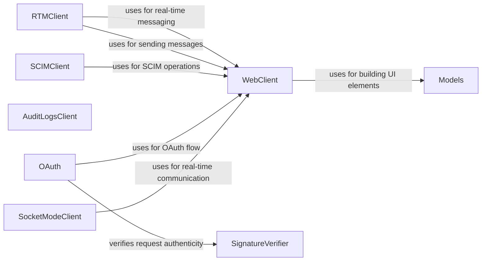

## Component Details

The Slack API Communication Layer provides a unified interface for interacting with various Slack APIs, including the Web API, RTM API, SCIM API, and Audit Logs API. It encapsulates the complexities of sending requests, handling responses, managing authentication, and ensuring reliable communication with Slack's services through retry mechanisms and error handling. This layer simplifies the integration of Slack functionalities into applications by providing dedicated clients for different API functionalities and managing the underlying communication protocols.

### WebClient
The WebClient component provides methods for interacting with Slack's Web API, enabling applications to send messages, retrieve user information, and perform administrative tasks within a Slack workspace. It handles authentication, request formatting, and response parsing for Web API calls.

**Related Classes/Methods**:

- <a href="https://github.com/slackapi/python-slack-sdk/blob/master/tests/slack_sdk/web/test_legacy_web_client_url_format.py#L29-L709" target="_blank" rel="noopener noreferrer">`slack_sdk.web.client.WebClient` (29:709)</a>
- `slack_sdk.web.async_client.AsyncWebClient` (full file reference)

### RTMClient
The RTMClient component handles communication with Slack's Real Time Messaging (RTM) API, allowing for real-time interactions with the Slack workspace. It establishes a WebSocket connection, sends and receives messages, and manages events for real-time communication.

**Related Classes/Methods**:

- <a href="https://github.com/slackapi/python-slack-sdk/blob/master/slack_sdk/rtm/__init__.py#L26-L570" target="_blank" rel="noopener noreferrer">`slack_sdk.rtm.RTMClient` (26:570)</a>

### SCIMClient
The SCIMClient component facilitates interaction with the Slack SCIM API, enabling user and group management within a Slack workspace. It supports operations like creating, reading, updating, and deleting users and groups through the SCIM protocol.

**Related Classes/Methods**:

- <a href="https://github.com/slackapi/python-slack-sdk/blob/master/slack_sdk/scim/v1/types.py#L24-L349" target="_blank" rel="noopener noreferrer">`slack_sdk.scim.v1.client.SCIMClient` (24:349)</a>
- `slack_sdk.scim.v1.async_client.AsyncSCIMClient` (full file reference)

### AuditLogsClient
The AuditLogsClient component provides methods for interacting with the Slack Audit Logs API, enabling the retrieval of audit logs for a Slack workspace. It allows applications to monitor and analyze activity within the workspace for security and compliance purposes.

**Related Classes/Methods**:

- <a href="https://github.com/slackapi/python-slack-sdk/blob/master/slack_sdk/audit_logs/v1/async_client.py#L22-L249" target="_blank" rel="noopener noreferrer">`slack_sdk.audit_logs.v1.client.AuditLogsClient` (22:249)</a>

### SignatureVerifier
The SignatureVerifier component is responsible for verifying the authenticity of requests sent to a Slack app. It ensures that the requests originate from Slack and haven't been tampered with, providing a security mechanism to prevent unauthorized access.

**Related Classes/Methods**:

- `slack_sdk.signature.SignatureVerifier` (full file reference)

### OAuth
The OAuth component handles the OAuth 2.0 authorization flow for Slack apps. It manages state, installation, and token rotation, enabling secure authentication and authorization for Slack applications.

**Related Classes/Methods**:

- <a href="https://github.com/slackapi/python-slack-sdk/blob/master/slack_sdk/oauth/installation_store/file/__init__.py#L17-L252" target="_blank" rel="noopener noreferrer">`slack_sdk.oauth.installation_store.file.FileInstallationStore` (17:252)</a>
- <a href="https://github.com/slackapi/python-slack-sdk/blob/master/slack_sdk/oauth/installation_store/sqlalchemy/__init__.py#L28-L375" target="_blank" rel="noopener noreferrer">`slack_sdk.oauth.installation_store.sqlalchemy.SQLAlchemyInstallationStore` (28:375)</a>
- <a href="https://github.com/slackapi/python-slack-sdk/blob/master/slack_sdk/oauth/installation_store/sqlite3/__init__.py#L15-L615" target="_blank" rel="noopener noreferrer">`slack_sdk.oauth.installation_store.sqlite3.SQLite3InstallationStore` (15:615)</a>
- <a href="https://github.com/slackapi/python-slack-sdk/blob/master/slack_sdk/oauth/state_store/file/__init__.py#L13-L71" target="_blank" rel="noopener noreferrer">`slack_sdk.oauth.state_store.file.FileOAuthStateStore` (13:71)</a>
- <a href="https://github.com/slackapi/python-slack-sdk/blob/master/slack_sdk/oauth/state_store/sqlalchemy/__init__.py#L15-L80" target="_blank" rel="noopener noreferrer">`slack_sdk.oauth.state_store.sqlalchemy.SQLAlchemyOAuthStateStore` (15:80)</a>
- <a href="https://github.com/slackapi/python-slack-sdk/blob/master/slack_sdk/oauth/state_store/sqlite3/__init__.py#L12-L96" target="_blank" rel="noopener noreferrer">`slack_sdk.oauth.state_store.sqlite3.SQLite3OAuthStateStore` (12:96)</a>
- `slack_sdk.oauth.redirect_uri_page_renderer.RedirectUriPageRenderer` (full file reference)
- <a href="https://github.com/slackapi/python-slack-sdk/blob/master/slack_sdk/oauth/installation_store/models/installation.py#L9-L200" target="_blank" rel="noopener noreferrer">`slack_sdk.oauth.installation_store.models.installation.Installation` (9:200)</a>

### SocketModeClient
The SocketModeClient component enables real-time communication with Slack using the Socket Mode protocol. It provides an alternative to the RTM API, allowing apps to receive events and send responses over a WebSocket connection without exposing a public HTTP endpoint.

**Related Classes/Methods**:

- <a href="https://github.com/slackapi/python-slack-sdk/blob/master/slack_sdk/socket_mode/aiohttp/__init__.py#L31-L463" target="_blank" rel="noopener noreferrer">`slack_sdk.socket_mode.aiohttp.SocketModeClient` (31:463)</a>
- <a href="https://github.com/slackapi/python-slack-sdk/blob/master/slack_sdk/socket_mode/websockets/__init__.py#L49-L272" target="_blank" rel="noopener noreferrer">`slack_sdk.socket_mode.websockets.SocketModeClient` (49:272)</a>
- `slack_sdk.socket_mode.builtin.client.SocketModeClient` (full file reference)
- <a href="https://github.com/slackapi/python-slack-sdk/blob/master/slack_sdk/socket_mode/websocket_client/__init__.py#L31-L264" target="_blank" rel="noopener noreferrer">`slack_sdk.socket_mode.websocket_client.SocketModeClient` (31:264)</a>
- `slack_sdk.socket_mode.response.SocketModeResponse` (full file reference)

### Models
The Models component defines data structures for representing various Slack objects, such as views, blocks, and basic components. These models facilitate the creation and manipulation of complex Slack UI elements, providing a structured way to interact with Slack's UI framework.

**Related Classes/Methods**:

- <a href="https://github.com/slackapi/python-slack-sdk/blob/master/slack_sdk/models/views/__init__.py#L9-L126" target="_blank" rel="noopener noreferrer">`slack_sdk.models.views.View` (9:126)</a>
- `slack_sdk.models.blocks.basic_components.PlainTextObject` (full file reference)
- `slack_sdk.models.blocks.blocks.InputBlock` (full file reference)
- <a href="https://github.com/slackapi/python-slack-sdk/blob/master/slack_sdk/models/blocks/block_elements.py#L1383-L1449" target="_blank" rel="noopener noreferrer">`slack_sdk.models.blocks.block_elements.PlainTextInputElement` (1383:1449)</a>
- `slack_sdk.models.basic_objects.JsonObject` (full file reference)
- `slack_sdk.models.blocks.blocks.SectionBlock` (full file reference)
- <a href="https://github.com/slackapi/python-slack-sdk/blob/master/slack_sdk/models/blocks/block_elements.py#L1093-L1158" target="_blank" rel="noopener noreferrer">`slack_sdk.models.blocks.block_elements.ConversationSelectElement` (1093:1158)</a>
- <a href="https://github.com/slackapi/python-slack-sdk/blob/master/slack_sdk/models/blocks/block_elements.py#L1161-L1225" target="_blank" rel="noopener noreferrer">`slack_sdk.models.blocks.block_elements.ConversationMultiSelectElement` (1161:1225)</a>
- `slack_sdk.models.blocks.blocks.CallBlock` (full file reference)