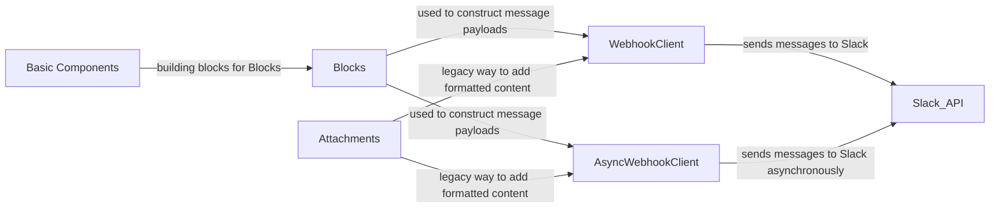

## Component Details

The Webhook Event Ingestion component provides a way to receive messages from Slack using incoming webhooks. It allows applications to receive notifications and updates from Slack channels without requiring complex API integrations. The core of this component revolves around the `WebhookClient` which sends HTTP POST requests to a Slack webhook URL. The messages can be composed using `Blocks` and `Basic Components` for rich formatting, or `Attachments` for a legacy approach. For asynchronous operations, `AsyncWebhookClient` is used. The `WebClient` and `AsyncWebClient` are used for verification purposes in integration tests.

### WebhookClient
The WebhookClient is responsible for sending messages to Slack using webhooks. It provides a simple interface for sending HTTP POST requests to a Slack webhook URL, allowing users to send messages, attachments, and blocks to a specified channel or user.

**Related Classes/Methods**:

- <a href="https://github.com/slackapi/python-slack-sdk/blob/master/tests/slack_sdk/webhook/test_webhook.py#L24-L174" target="_blank" rel="noopener noreferrer">`slack_sdk.webhook.client.WebhookClient` (24:174)</a>
- `slack_sdk.webhook.client.WebhookClient.send` (71:169)

### AsyncWebhookClient
The AsyncWebhookClient is an asynchronous version of the WebhookClient, designed for use with asyncio. It provides the same functionality as the WebhookClient but uses asynchronous HTTP requests to send messages to Slack, making it suitable for applications that require non-blocking I/O.

**Related Classes/Methods**:

- <a href="https://github.com/slackapi/python-slack-sdk/blob/master/tests/slack_sdk/webhook/test_webhook.py#L24-L174" target="_blank" rel="noopener noreferrer">`slack_sdk.webhook.async_client.AsyncWebhookClient` (24:174)</a>
- `slack_sdk.webhook.async_client.AsyncWebhookClient.send` (71:169)

### Blocks
The Blocks are a modular way to compose messages in Slack. They allow you to create visually rich and interactive messages using a variety of pre-defined components, such as sections, dividers, actions, and input fields. These components are used to construct the message payload sent via the WebhookClient and AsyncWebhookClient.

**Related Classes/Methods**:

- <a href="https://github.com/slackapi/python-slack-sdk/blob/master/slack_sdk/models/blocks/block_elements.py#L24-L174" target="_blank" rel="noopener noreferrer">`slack_sdk.models.blocks.blocks.SectionBlock` (24:174)</a>
- <a href="https://github.com/slackapi/python-slack-sdk/blob/master/slack_sdk/models/blocks/block_elements.py#L24-L174" target="_blank" rel="noopener noreferrer">`slack_sdk.models.blocks.blocks.DividerBlock` (24:174)</a>
- <a href="https://github.com/slackapi/python-slack-sdk/blob/master/slack_sdk/models/blocks/block_elements.py#L24-L174" target="_blank" rel="noopener noreferrer">`slack_sdk.models.blocks.blocks.ActionsBlock` (24:174)</a>

### Basic Components
Basic components are fundamental building blocks for creating Blocks. They include text objects (plain text and markdown), and elements like buttons. These components are used to define the content and interactivity of the Blocks.

**Related Classes/Methods**:

- <a href="https://github.com/slackapi/python-slack-sdk/blob/master/slack_sdk/models/blocks/block_elements.py#L24-L174" target="_blank" rel="noopener noreferrer">`slack_sdk.models.blocks.basic_components.MarkdownTextObject` (24:174)</a>
- <a href="https://github.com/slackapi/python-slack-sdk/blob/master/slack_sdk/models/blocks/block_elements.py#L24-L174" target="_blank" rel="noopener noreferrer">`slack_sdk.models.blocks.basic_components.PlainTextObject` (24:174)</a>

### Attachments
Attachments are a legacy way to add formatted content to Slack messages. While Blocks are the recommended approach for new applications, Attachments are still supported and can be used to include formatted text, images, and other content in messages sent via the WebhookClient and AsyncWebhookClient.

**Related Classes/Methods**:

- <a href="https://github.com/slackapi/python-slack-sdk/blob/master/slack_sdk/models/attachments/__init__.py#L264-L426" target="_blank" rel="noopener noreferrer">`slack_sdk.models.attachments.Attachment` (264:426)</a>
- <a href="https://github.com/slackapi/python-slack-sdk/blob/master/slack_sdk/models/attachments/__init__.py#L249-L261" target="_blank" rel="noopener noreferrer">`slack_sdk.models.attachments.AttachmentField` (249:261)</a>