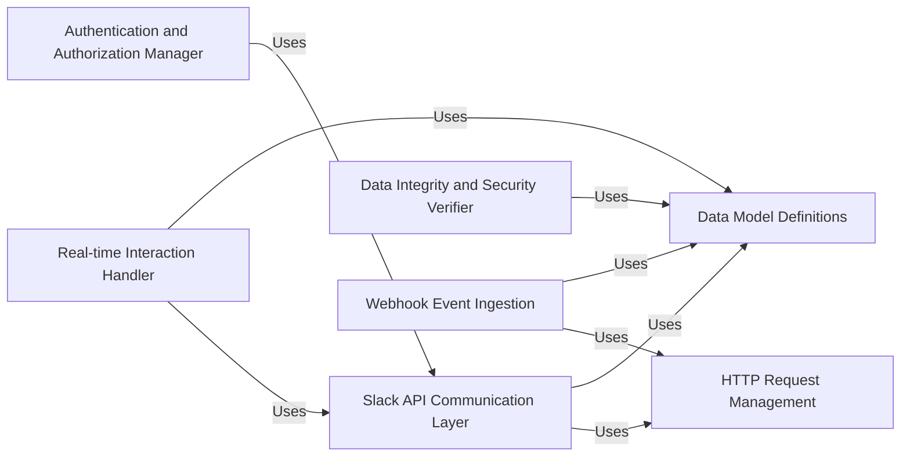

## Component Details

The python-slack-sdk provides a comprehensive set of tools and clients for interacting with the Slack platform. It abstracts away the complexities of the Slack APIs, offering developers a simplified and consistent interface for building Slack applications. The core functionality revolves around sending and receiving messages, managing users and channels, handling OAuth authentication, and ensuring the security of communications. The library supports both synchronous and asynchronous operations, making it suitable for a wide range of applications.

### Slack API Communication Layer
This component encapsulates all functionalities related to communicating with Slack's various APIs, including the Web API, RTM API, SCIM API, and Audit Logs API. It provides a unified interface for sending requests, handling responses, and managing authentication. The component also includes retry mechanisms and error handling to ensure reliable communication with Slack's services.

**Related Classes/Methods**:

- <a href="https://github.com/slackapi/python-slack-sdk/blob/master/tests/slack_sdk/web/test_legacy_web_client_url_format.py#L29-L709" target="_blank" rel="noopener noreferrer">`slack_sdk.web.client.WebClient` (29:709)</a>
- <a href="https://github.com/slackapi/python-slack-sdk/blob/master/slack_sdk/rtm/__init__.py#L26-L570" target="_blank" rel="noopener noreferrer">`slack_sdk.rtm.RTMClient` (26:570)</a>
- <a href="https://github.com/slackapi/python-slack-sdk/blob/master/slack_sdk/scim/v1/types.py#L24-L349" target="_blank" rel="noopener noreferrer">`slack_sdk.scim.v1.client.SCIMClient` (24:349)</a>
- <a href="https://github.com/slackapi/python-slack-sdk/blob/master/slack_sdk/audit_logs/v1/async_client.py#L22-L249" target="_blank" rel="noopener noreferrer">`slack_sdk.audit_logs.v1.client.AuditLogsClient` (22:249)</a>

### Real-time Interaction Handler
This component manages real-time interactions with Slack using WebSocket connections. It handles the connection lifecycle, sends and receives messages, and dispatches events to registered listeners. It supports both the legacy RTM API and the newer Socket Mode, providing a flexible way for applications to receive real-time updates from Slack and respond to user interactions instantly.

**Related Classes/Methods**:

- <a href="https://github.com/slackapi/python-slack-sdk/blob/master/slack_sdk/rtm/__init__.py#L26-L570" target="_blank" rel="noopener noreferrer">`slack_sdk.rtm.RTMClient` (26:570)</a>
- <a href="https://github.com/slackapi/python-slack-sdk/blob/master/tests/slack_sdk/socket_mode/test_websocket_client.py#L31-L169" target="_blank" rel="noopener noreferrer">`slack_sdk.socket_mode.client.BaseSocketModeClient` (31:169)</a>
- <a href="https://github.com/slackapi/python-slack-sdk/blob/master/slack_sdk/socket_mode/aiohttp/__init__.py#L31-L463" target="_blank" rel="noopener noreferrer">`slack_sdk.socket_mode.aiohttp.SocketModeClient` (31:463)</a>
- <a href="https://github.com/slackapi/python-slack-sdk/blob/master/slack_sdk/socket_mode/websockets/__init__.py#L49-L272" target="_blank" rel="noopener noreferrer">`slack_sdk.socket_mode.websockets.SocketModeClient` (49:272)</a>

### Authentication and Authorization Manager
This component handles the OAuth 2.0 flow for authenticating users and installing Slack apps. It includes functionalities for generating authorization URLs, storing OAuth state, and managing installation data. It supports various storage backends, such as files and databases, providing flexibility for different application environments. This component simplifies the process of integrating Slack apps with user accounts and ensures secure access to Slack resources.

**Related Classes/Methods**:

- <a href="https://github.com/slackapi/python-slack-sdk/blob/master/slack_sdk/oauth/installation_store/file/__init__.py#L17-L252" target="_blank" rel="noopener noreferrer">`slack_sdk.oauth.installation_store.file.FileInstallationStore` (17:252)</a>
- <a href="https://github.com/slackapi/python-slack-sdk/blob/master/slack_sdk/oauth/state_store/file/__init__.py#L13-L71" target="_blank" rel="noopener noreferrer">`slack_sdk.oauth.state_store.file.FileOAuthStateStore` (13:71)</a>
- <a href="https://github.com/slackapi/python-slack-sdk/blob/master/tests/slack_sdk/oauth/authorize_url_generator/test_generator.py#L24-L100" target="_blank" rel="noopener noreferrer">`slack_sdk.oauth.authorize_url_generator.AuthorizeUrlGenerator` (24:100)</a>

### Data Integrity and Security Verifier
This component focuses on ensuring the integrity and security of communications with Slack. It includes functionalities for verifying request signatures to prevent tampering and unauthorized access. This component is crucial for protecting applications from malicious attacks and ensuring that only authentic requests are processed.

**Related Classes/Methods**:

- <a href="https://github.com/slackapi/python-slack-sdk/blob/master/tests/slack_sdk/signature/__init__.py#L24-L114" target="_blank" rel="noopener noreferrer">`slack_sdk.signature.SignatureVerifier` (24:114)</a>

### Data Model Definitions
This component defines data models for various Slack objects, such as messages, blocks, attachments, and views. These models provide a convenient way to represent and manipulate Slack data in Python code. They ensure consistency and type safety when working with Slack data.

**Related Classes/Methods**:

- <a href="https://github.com/slackapi/python-slack-sdk/blob/master/slack_sdk/models/messages/__init__.py#L0-L0" target="_blank" rel="noopener noreferrer">`slack_sdk.models.messages` (0:0)</a>
- <a href="https://github.com/slackapi/python-slack-sdk/blob/master/slack_sdk/models/blocks/block_elements.py#L0-L0" target="_blank" rel="noopener noreferrer">`slack_sdk.models.blocks` (0:0)</a>
- <a href="https://github.com/slackapi/python-slack-sdk/blob/master/slack_sdk/models/attachments/__init__.py#L0-L0" target="_blank" rel="noopener noreferrer">`slack_sdk.models.attachments` (0:0)</a>

### HTTP Request Management
This component provides functionalities for managing HTTP requests, including automatic retries and proxy support. It improves the reliability of Slack API interactions by automatically handling transient errors and network issues. It encapsulates the logic for sending HTTP requests and handling responses, providing a consistent interface for other components to interact with Slack's APIs.

**Related Classes/Methods**:

- <a href="https://github.com/slackapi/python-slack-sdk/blob/master/tests/slack_sdk/http_retry/test_builtins.py#L25-L174" target="_blank" rel="noopener noreferrer">`slack_sdk.http_retry.handler.RetryHandler` (25:174)</a>

### Webhook Event Ingestion
This component provides a simple way to receive messages from Slack using incoming webhooks. It supports sending text messages, attachments, and blocks. This component offers a straightforward method for applications to receive notifications and updates from Slack channels without requiring complex API integrations.

**Related Classes/Methods**:

- <a href="https://github.com/slackapi/python-slack-sdk/blob/master/tests/slack_sdk/webhook/test_webhook.py#L24-L174" target="_blank" rel="noopener noreferrer">`slack_sdk.webhook.client.WebhookClient` (24:174)</a>