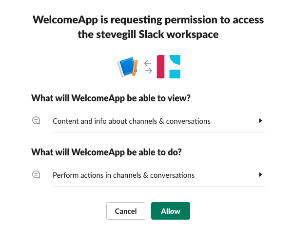

# Understanding OAuth scopes for bots

In this tutorial, we'll:

* explore Slack app permissions and distribution using OAuth, and along the way, learn how to identify which scopes apps need and how to use OAuth to request them.
* build an app that sends a direct message to users joining a specific channel. Once installed in a workspace, it will create a new channel named **#the-welcome-channel** if it doesn’t already exist. The channel will be used to thank users for joining the channel. We'll also share code snippets from the app, but the full source code is available on [GitHub](https://github.com/stevengill/slack-python-oauth-example). The code and implementation of OAuth is general enough that you should be able to follow along, even if Python isn't your preferred language.

## Prerequisites {#prerequisites}

Before we get started, ensure you have a development workspace with permissions to install apps. If you don’t have one set up, go ahead and [create one](https://slack.com/create). You also need to [create a new app](https://api.slack.com/apps/new) if you haven’t already. 

Let’s get started!

## Determining scopes {#determine-scopes}

Scopes are used to grant your app permission to perform functions in Slack, such as calling Web API methods and receiving Events API events. As a user goes through your app's installation flow, they'll need to permit access to the scopes your app is requesting.

To determine which scopes we need, we should take a closer look at what our app does. Instead of scouring the entire list of scopes that might make sense, we can look at what events or methods we need for the app, and build out our scope list as we go.

1. After installation, our app checks to see if a channel exists (private or public since we can’t create a new channel with the same name). A quick search through the list of methods leads us to the `conversations.list` API method, which we can use to get the names of public & private channels. It also shows us what scopes are needed to use this method. In our case, we need `channels:read` and `groups:read`. (We don’t need `im:read` or `mpim:read`, as we aren’t concerned about the names of direct messages.)

    ```
    import os
    from slack_sdk import WebClient
    
    # verifies if "the-welcome-channel" already exists
    def channel_exists():
        token = os.environ["SLACK_BOT_TOKEN"]
        client = WebClient(token=token)

        # grab a list of all the channels in a workspace
        clist = client.conversations_list()
        exists = False
        for k in clist["channels"]:
            # look for the channel in the list of existing channels
            if k['name'] == 'the-welcome-channel':
                exists = True
                break
        if exists == False:
            # create the channel since it doesn't exist
            create_channel()
    ```

2. If the channel doesn’t already exist, we need to create it. Looking through the list of API methods leads us to the `conversations.create` API method, which needs the scope `channels:manage`.

    ```
    # creates a channel named "the-welcome-channel"
    def create_channel():
        token = os.environ["SLACK_BOT_TOKEN"]
        client = WebClient(token=token)
        resp = client.conversations_create(name="the-welcome-channel")
    ```

3. When a user joins our newly created channel, our app sends them a direct message. To see when a user joins our channel, we need to listen for an event. Looking at our list of events, we see that `member_joined_channel` is the event that we need (_Note: events need to be added to your app’s configuration_). The scopes required for this event are `channels:read` and `groups:read` (same ones from step one). Now to send a direct message, we need to use the `chat.postMessage` API method, which requires the `chat:write` scope.

    ```
    # Create an event listener for "member_joined_channel" events
    # Sends a DM to the user who joined the channel
    @slack_events_adapter.on("member_joined_channel")
    def member_joined_channel(event_data):
        user = event_data['event']['user']
        token = os.environ["SLACK_BOT_TOKEN"]
        client = WebClient(token=token)
        msg = 'Welcome! Thanks for joining the-welcome-channel'
        client.chat_postMessage(channel=user, text=msg)
    ```

Our final list of scopes required are: 
* `channels:read`
* `groups:read`
* `channels:manage`
* `chat:write`

## Setting up OAuth and requesting scopes {#setup}

If you want users to be able to install your app on additional workspaces or from the [Slack Marketplace](https://docs.slack.dev/slack-marketplace/slack-marketplace-review-guide), you'll need to implement an OAuth flow.

We'll be following the general flow of OAuth with Slack, which is covered in the [installing with OAuth](https://docs.slack.dev/authentication/installing-with-oauth) guide and nicely illustrated in the image below:


1. **Requesting Scopes** 

    This first step is sometimes also referred to as "redirect to Slack" or "Add to Slack button". In this step, we redirect to Slack and pass along our list of required scopes, client ID, and state as query parameters in the URL. You can get the client ID from the **Basic Information** section of your app. State is an optional value, but is recommended to prevent [CSRF attacks](https://en.wikipedia.org/wiki/Cross-site_request_forgery).

    ```
    https://slack.com/oauth/v2/authorize?scope=channels:read,groups:read,channels:manage,chat:write&client_id=YOUR_CLIENT_ID&state=STATE_STRING
    ```

    _It is also possible to pass in a `redirect\_uri` into your URL. A `redirect\_uri` is used for Slack to know where to send the request after the user has granted permission to your app. In our example, instead of passing one in the URL, we request that you add a Redirect URL in your app’s configuration on [api.slack.com/apps](https://api.slack.com/apps) under the **OAuth and Permissions** section._

    Next, we'll create a route in our app that contains an **Add to Slack** button using that URL above.

    ```
    # Grab client ID from your environment variables
    client_id = os.environ["SLACK_CLIENT_ID"]
    # Generate random string to use as state to prevent CSRF attacks
    from uuid import uuid4
    state = str(uuid4())

    # Route to kick off Oauth flow
    @app.route("/begin_auth", methods=["GET"])
    def pre_install():
        return f'<a href="https://slack.com/oauth/v2/authorize?scope=channels:read,groups:read,channels:manage,chat:write&client_id={ client_id }&state={ state }"></a>'
    ```

    Now when a user navigates to the route, they should see the **Add to Slack** button.

    Clicking the button will trigger the next step.

2. **Waiting for user approval**

    The user will see the app installation UI (shown below) and will have the option to accept the permissions and allow the app to install to the workspace:

    

3. **Exchanging a temporary authorization code for an access token**

    After the user approves the app, Slack will redirect the user to your specified Redirect URL. As we mentioned earlier, we did not include a `redirect_uri` in our **Add to Slack** button, so our app will use our Redirect URL specified on the app’s **OAuth and Permissions** page.

    Our Redirect URL function will have to parse the HTTP request for the `code` and `state` query parameters. We need to check that the `state` parameter was created by our app. If it is, we can now exchange the `code` for an access token. To do this, we need to call the `oauth.v2.access` API method with the `code`, `client_id`, and `client_secret`. This method will return the access token, which we can now save (preferably in a persistent database) and use for any of the Slack API method calls we make. (_Note: use this access token for all of the Slack API method calls we covered in the scopes section above_)

    ```
    # Grab client Secret from your environment variables
    client_secret = os.environ["SLACK_CLIENT_SECRET"]

    # Route for Oauth flow to redirect to after user accepts scopes
    @app.route("/finish_auth", methods=["GET", "POST"])
    def post_install():
        # Retrieve the auth code and state from the request params
        auth_code = request.args['code']
        received_state = request.args['state']

    # This request doesn't need a token so an empty string will suffice
    client = WebClient(token="")

    # verify state received in params matches state we originally sent in auth request
    if received_state == state:
        # Request the auth tokens from Slack
        response = client.oauth_v2_access(
            client_id=client_id,
            client_secret=client_secret,
            code=auth_code
        )
    else:
        return "Invalid State"

    # Save the bot token to an environmental variable or to your data store
    os.environ["SLACK_BOT_TOKEN"] = response['access_token']

    # See if "the-welcome-channel" exists. Create it if it doesn't.
    channel_exists()

    # Don't forget to let the user know that auth has succeeded!
    return "Auth complete!"
    ```

## Next steps {#next}

At this point, you should feel more comfortable learning what scopes your app needs and using OAuth to request those scopes. A few resources you can check out next include:

*   [Slack-Python-OAuth-Example](https://github.com/stevengill/slack-python-oauth-example): we used code snippets from this app in this tutorial. The README contains more detailed information about running the app locally using ngrok, setting up a Redirect URL for OAuth, and setting up a request URL for events.
*   Learn more about [installing with OAuth](https://docs.slack.dev/authentication/installing-with-oauth).
