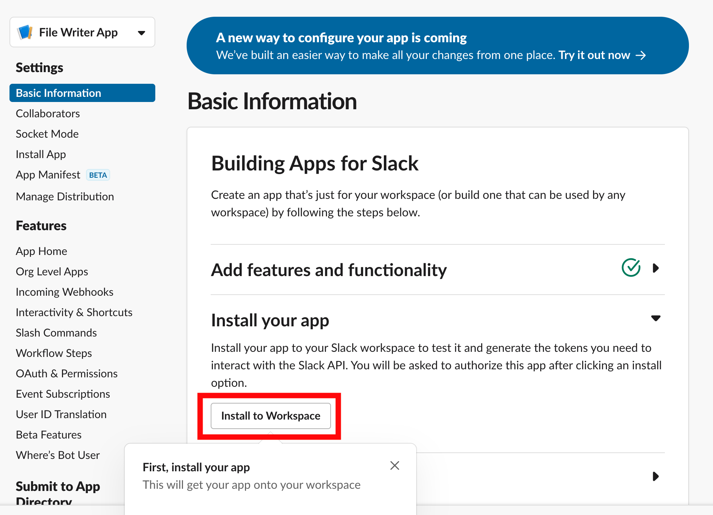
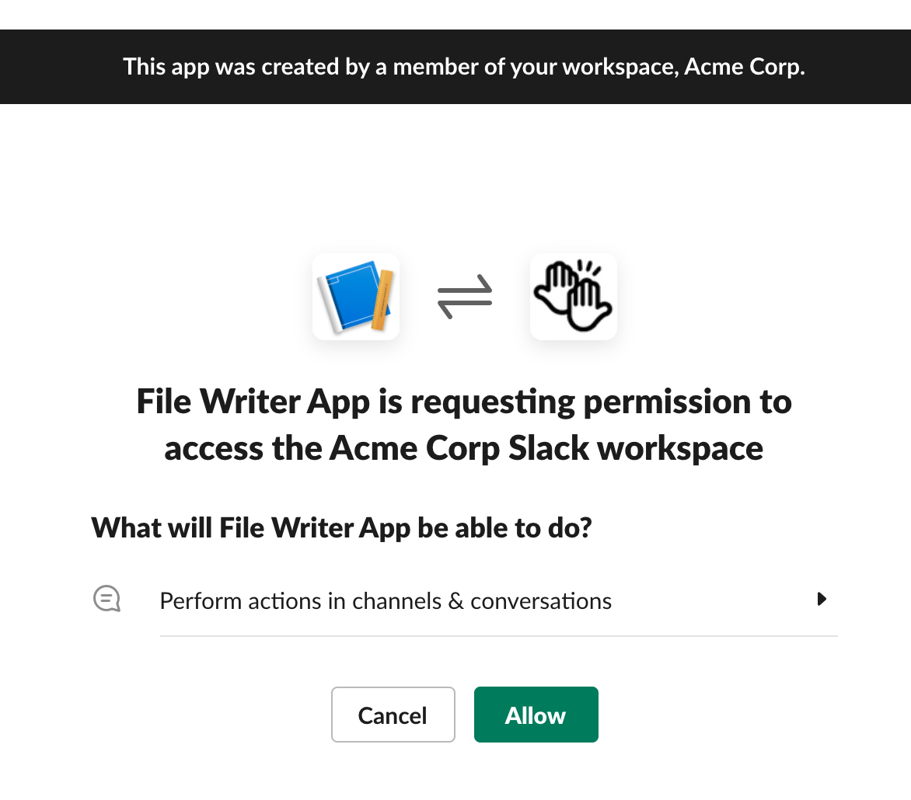
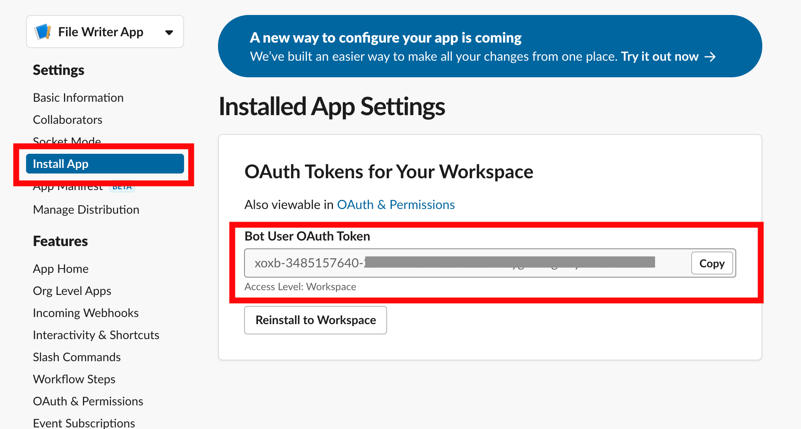
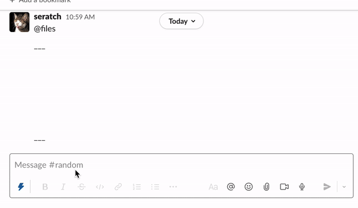
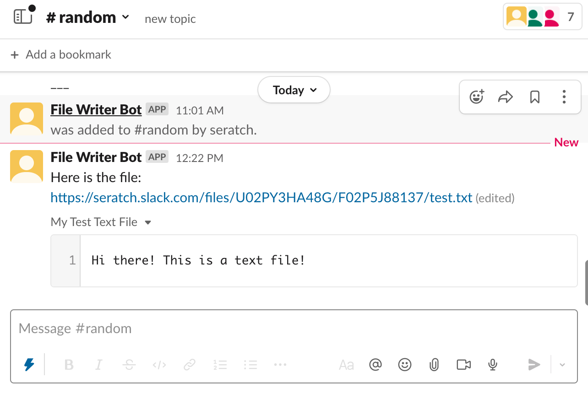
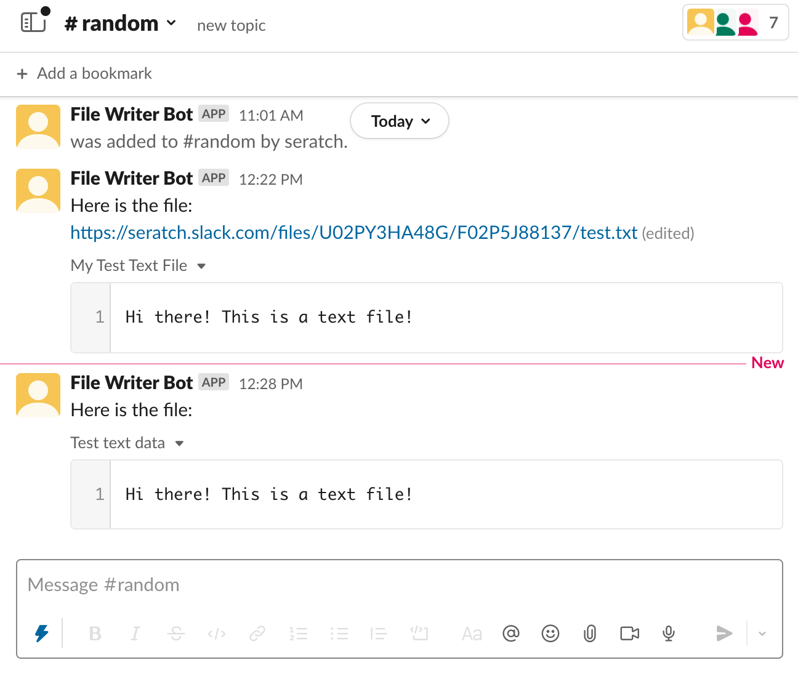
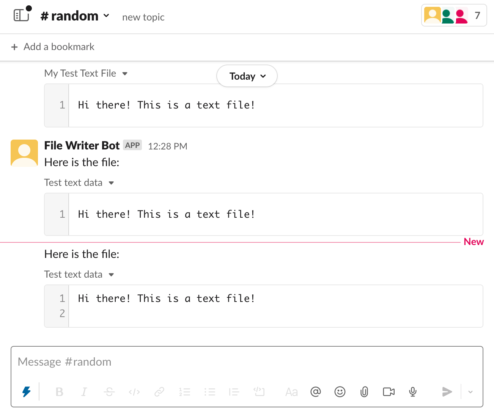
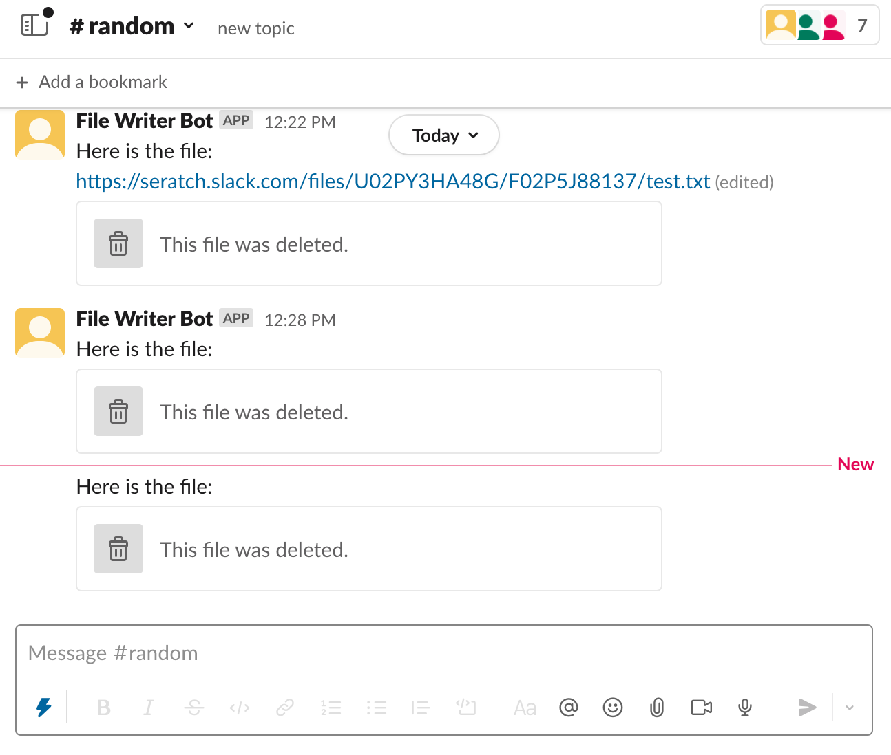

# Uploading files with Python

This tutorial details how to use the [`slack-sdk` package for Python](https://pypi.org/project/slack-sdk/) to upload files to a channel in Slack with some code samples. In addition to looking at how to upload files, we'll also cover listing and deleting files via the Web API using the Python SDK.

## Creating an app {#create-app}

First, create a [Slack app](https://api.slack.com/apps/new).

## Configuring your app's settings with an app manifest {#configuration}

Creating your app using this method will include all the required settings for this tutorial, and you won't be bogged down with too many details - all you'll need to do is decide where this app will live. If you're curious about the inner workings of how this button works, refer to [App Manifests](/app-manifests) for more information.

```yaml
_metadata:
  major_version: 1
  minor_version: 1
display_information:
  name: File Writer App
features:
  bot_user:
    display_name: File Writer Bot
oauth_config:
  scopes:
    bot:
      # Used to send messages to a channel
      - chat:write
      # This scope is not required if your app will just upload files. We've included it in order to use the `files.info` `files.list` methods.
      - files:read
      # Used to upload files to Slack
      - files:write
```

## Installing your app in a workspace {#installing}

Once you've created your app, you'll see an **Install to Workspace** button. Click it to install your app in your workspace.



Next, click **Allow** to authorize the app in your workspace.



Navigate to the **Install App** section under **Settings**. Here, you'll find your `Bot User OAuth Token`.



Set this token value as an environment variable called `SLACK_BOT_TOKEN` by using the following command:

```bash
export SLACK_BOT_TOKEN=<your token>
```

With this, all your Slack app configuration is done. Let's start coding.

## Using Python to upload a file {#upload-file-with-python}

### Creating a new project {#create-new-project}

First, ensure you're using Python version 3.6 or above. While the current standard is for the `python3` and `pip3` commands to use Python 3.6 or above, it's best to ensure your runtime is always using the latest version of Python. [pyenv](https://github.com/pyenv/pyenv) is a handy tool that can do this for you. 

We'll create a brand new virtual environment and install the required library dependencies using the following commands.

```bash
echo 'slack-sdk>=3.12,<4' > requirements.txt
python3 -m venv .venv
source .venv/bin/activate
pip install -U pip
pip install -r requirements.txt
```

### Uploading a file {#upload-file}

While it's possible to enter the following into the Python shell, we've gathered some code samples and wrote it in script form.

For each of the code samples, make sure to add in the following to the top of your Python file if you're going to run it as a script - the examples won't run without it.

```python
import logging, os

# Sets the debug level. 
# If you're using this in production, you can change this back to INFO and add extra log entries as needed.
logging.basicConfig(level=logging.DEBUG)

# Initialize the Web API client.
# This expects that you've already set your SLACK_BOT_TOKEN as an environment variable.
# Try to resist the urge to put your token directly in your code; it is best practice not to.
from slack_sdk import WebClient
client = WebClient(os.environ["SLACK_BOT_TOKEN"])
```

Let's make sure our token is correctly configured.

```python
# Tests to see if the token is valid
auth_test = client.auth_test()
bot_user_id = auth_test["user_id"]
print(f"App's bot user: {bot_user_id}")
```

Once you run this code, you'll see something similar to the following within the logs:

```bash
>>> auth_test = client.auth_test()
DEBUG:slack_sdk.web.base_client:Sending a request - url: https://www.slack.com/api/auth.test, query_params: {}, body_params: {}, files: {}, json_body: None, headers: {}
DEBUG:slack_sdk.web.base_client:Received the following response - status: 200, headers: {}, body: {"ok":true,"url":"https:\/\/example.slack.com\/","team":"Acme Corp","user":"file_writer_bot","team_id":"T1234567890","user_id":"U02PY3HA48G","bot_id":"B02P8CPE143","is_enterprise_install":false}

>>> bot_user_id = auth_test["user_id"]
>>> print(f"App's bot user: {bot_user_id}")
App's bot user: U02PY3HA48G
```

Notice that your bot user's `user_id` can be found within these logs. Any files uploaded using a bot token will be associated with the bot user.

At this point, while no files have been uploaded yet, you can call the `files.list` API method to confirm this fact.  We'll do this again after we've uploaded some files to see what has changed.

```python
>>> files = client.files_list(user=bot_user_id)
DEBUG:slack_sdk.web.base_client:Sending a request - url: https://www.slack.com/api/files.list, query_params: {}, body_params: {'user': 'U02PY3HA48G'}, files: {}, json_body: None, headers: {}
DEBUG:slack_sdk.web.base_client:Received the following response - status: 200, headers: {}, body: {"ok":true,"files":[],"paging":{"count":100,"total":0,"page":1,"pages":0}}
```

Let's try uploading a file using text supplied to the `content` parameter. This will upload a text file with the specified `content`.

```python
new_file = client.files_upload_v2(
    title="My Test Text File",
    filename="test.txt",
    content="Hi there! This is a text file!",
)
```

Doing this within the Python shell will display the following:

```python
>>> new_file = client.files_upload_v2(
...     title="My Test Text File",
...     filename="test.txt",
...     content="Hi there! This is a text file!",
... )
DEBUG:slack_sdk.web.base_client:Sending a request - url: https://www.slack.com/api/files.getUploadURLExternal, query_params: {}, body_params: {'filename': 'test.txt', 'length': 30}, files: {}, json_body: None, headers: {'Content-Type': 'application/x-www-form-urlencoded', 'Authorization': '(redacted)', 'User-Agent': 'Python/3.11.6 slackclient/3.27.1 Darwin/23.3.0'}
DEBUG:slack_sdk.web.base_client:Received the following response - status: 200, headers: {'date': 'Fri, 08 Mar 2024 08:27:40 GMT', 'server': 'Apache', 'vary': 'Accept-Encoding', 'x-slack-req-id': '9rj4io2i10iawjdasdfas', 'x-content-type-options': 'nosniff', 'x-xss-protection': '0', 'pragma': 'no-cache', 'cache-control': 'private, no-cache, no-store, must-revalidate', 'expires': 'Sat, 26 Jul 1997 05:00:00 GMT', 'content-type': 'application/json; charset=utf-8', 'x-accepted-oauth-scopes': 'files:write', 'x-oauth-scopes': 'chat:write,files:read,files:write', 'access-control-expose-headers': 'x-slack-req-id, retry-after', 'access-control-allow-headers': 'slack-route, x-slack-version-ts, x-b3-traceid, x-b3-spanid, x-b3-parentspanid, x-b3-sampled, x-b3-flags', 'strict-transport-security': 'max-age=31536000; includeSubDomains; preload', 'referrer-policy': 'no-referrer', 'x-slack-unique-id': 'ZerL-asd3k201a0sdfa', 'x-slack-backend': 'r', 'access-control-allow-origin': '*', 'content-length': '257', 'via': '1.1 slack-prod.tinyspeck.com, envoy-www-iad-upnvxyvr, envoy-edge-nrt-ixozsome', 'x-envoy-attempt-count': '1', 'x-envoy-upstream-service-time': '195', 'x-backend': 'main_normal main_canary_with_overflow main_control_with_overflow', 'x-server': 'slack-www-hhvm-main-iad-bgpy', 'x-slack-shared-secret-outcome': 'no-match', 'x-edge-backend': 'envoy-www', 'x-slack-edge-shared-secret-outcome': 'no-match', 'connection': 'close'}, body: {"ok":true,"upload_url":"https:\/\/files.slack.com\/upload\/v1\/CwABAASWWgoAAZOR9CgFYdQZCgACF7q8rQ4fIhASAAAVDFERDNKSDNLCwACAAAAC1UwNk5GNjdGNUxNCwADAAAAC0YwNk40VDdGWk5LAAoABAAAAAAAAAAeAAsAAgAAABRmH2dkKc07lhAASAWWpZAA","file_id":"F2910294A"}
DEBUG:slack_sdk.web.base_client:('Received the following response - ', "status: 200, headers: {'Content-Type': 'text/plain; charset=utf-8', 'Content-Length': '7', 'Connection': 'close', 'x-backend': 'miata-prod-nrt-v2-5976497578-js557', 'date': 'Fri, 08 Mar 2024 08:27:40 GMT', 'x-envoy-upstream-service-time': '401', 'x-edge-backend': 'miata', 'x-slack-edge-shared-secret-outcome': 'shared-secret', 'server': 'envoy', 'via': 'envoy-edge-nwt-aaoskwwo, 1.1 f752a4d41a2512ine9asfa.cloudfront.net (CloudFront)', 'X-Cache': 'Miss from cloudfront', 'X-Amz-Cf-Pop': 'NRT51-C4', 'X-Amz-Cf-Id': 'jxcP2ao0fs4KXanisi9aiswiaKBiJQ==', 'Cross-Origin-Resource-Policy': 'cross-origin'}, body: OK - 30")
DEBUG:slack_sdk.web.base_client:Sending a request - url: https://www.slack.com/api/files.completeUploadExternal, query_params: {}, body_params: {'files': '[{"id": "F2910294A", "title": "My Test Text File"}]'}, files: {}, json_body: None, headers: {'Content-Type': 'application/x-www-form-urlencoded', 'Authorization': '(redacted)', 'User-Agent': 'Python/3.11.6 slackclient/3.27.1 Darwin/23.3.0'}
DEBUG:slack_sdk.web.base_client:Received the following response - status: 200, headers: {'date': 'Fri, 08 Mar 2024 08:27:41 GMT', ... body: {"ok":true,"files":[{"id":"F2910294A","created":1709886459,"timestamp":1709886459,"name":"test.txt","title":"My Test Text File","mimetype":"text\/plain","filetype":"text","pretty_type":"Plain Text","user":"U10AWOAW","user_team":"T12391022","editable":true,"size":30,"mode":"snippet","is_external":false,"external_type":"","is_public":false,"public_url_shared":false,"display_as_bot":false,"username":"","url_private":"https:\/\/files.slack.com\/files-pri\/T12391022-F2910294A\/test.txt","url_private_download":"https:\/\/files.slack.com\/files-pri\/T12391022-F2910294A\/download\/test.txt","permalink":"https:\/\/platform-ce.slack.com\/files\/U10AWOAW\/F2910294A\/test.txt","permalink_public":"https:\/\/slack-files.com\/T12391022-F2910294A-100e14d15f","edit_link":"https:\/\/platform-ce.slack.com\/files\/U10AWOAW\/F2910294A\/test.txt\/edit","preview":"Hi there! This is a text file!","preview_highlight":"<div class=\"CodeMirror cm-s-default CodeMirrorServer\">\n<div class=\"CodeMirror-code\">\n<div><pre>Hi there! This is a text file!<\/pre><\/div>\n<\/div>\n<\/div>\n","lines":1,"lines_more":0,"preview_is_truncated":false,"comments_count":0,"is_starred":false,"shares":{},"channels":[],"groups":[],"ims":[],"has_more_shares":false,"has_rich_preview":false,"file_access":"visible"}]}
```

We can confirm that a file has been uploaded using the `files.list` API method mentioned earlier. Wait a moment before calling this method, as there may be a bit of a lag before files are reflected within the results.

```python
>>> files = client.files_list(user=bot_user_id)
DEBUG:slack_sdk.web.base_client:Sending a request - url: https://www.slack.com/api/files.list, query_params: {}, body_params: {'user': 'U02PY3HA48G'}, files: {}, json_body: None, headers: {}
DEBUG:slack_sdk.web.base_client:Received the following response - status: 200, headers: {}, body: {"ok":true,"files":[{"id":"F02P5J88137","created":1638414790,"timestamp":1638414790,"name":"test.txt","title":"My Test Text File","mimetype":"text\/plain","filetype":"text","pretty_type":"Plain Text","user":"U02PY3HA48G","editable":true,"size":30,"mode":"snippet","is_external":false,"external_type":"","is_public":false,"public_url_shared":false,"display_as_bot":false,"username":"","url_private":"https:\/\/files.slack.com\/files-pri\/T03E94MJU-F02P5J88137\/test.txt","url_private_download":"https:\/\/files.slack.com\/files-pri\/T03E94MJU-F02P5J88137\/download\/test.txt","permalink":"https:\/\/seratch.slack.com\/files\/U02PY3HA48G\/F02P5J88137\/test.txt","permalink_public":"https:\/\/slack-files.com\/T03E94MJU-F02P5J88137-e3fda671e9","edit_link":"https:\/\/seratch.slack.com\/files\/U02PY3HA48G\/F02P5J88137\/test.txt\/edit","preview":"Hi there! This is a text file!","preview_highlight":"<div class=\"CodeMirror cm-s-default CodeMirrorServer\" oncopy=\"if(event.clipboardData){event.clipboardData.setData('text\/plain',window.getSelection().toString().replace(\/\\u200b\/g,''));event.preventDefault();event.stopPropagation();}\">\n<div class=\"CodeMirror-code\">\n<div><pre>Hi there! This is a text file!<\/pre><\/div>\n<\/div>\n<\/div>\n","lines":1,"lines_more":0,"preview_is_truncated":false,"channels":[],"groups":[],"ims":[],"comments_count":0}],"paging":{"count":100,"total":1,"page":1,"pages":1}}
```

Back in Slack, you'll notice that nothing has happened. How curious...

### Sharing a file within a channel {#sharing}

At this point, we have indeed uploaded a file to Slack, but only the bot user is able to view it.

Let's share this file with other users within our workspace. To do so, we'll use the `chat.postMessage` API method to post a message.

In this example, we've used the channel name `C123456789`, but you'll need to find the ID of the channel that you want to share your file to. When you're in your channel of choice, you can find the channel ID by clicking on the channel name at the top and then scrolling to the bottom of the screen that shows up.

Just like in the image below, mention the File Writer Bot and invite it to the `#random` channel.



Next, use the following code to retrieve the file's permalink and post it within a channel.

```python
file_url = new_file.get("file").get("permalink")
new_message = client.chat_postMessage(
    channel="C123456789",
    text=f"Here is the file: {file_url}",
)
```

By doing this, you'll be able to see the file within Slack.



### Specifying a channel when uploading a file {#specifying-channel}

While this exercise was very informative, having to do these two steps every time we upload a file is a bit cumbersome. Instead, we can specify the `channel` parameter to the function. This is the more common way of uploading a file from an app.

```python
upload_and_then_share_file = client.files_upload_v2(
    channel="C123456789",
    title="Test text data",
    filename="test.txt",
    content="Hi there! This is a text file!",
    initial_comment="Here is the file:",
)
```

By running the above code, you'll share the same file without having to send a message with the file URL.



### Uploading local files {#upload-local-files}

If you have an image file lying around, feel free to use that but for simplicity's sake. We'll continue using a text file here. You can create a local file by using the following command:

```bash
echo 'Hi there! This is a text file!' > test.txt
```

Next, within the same directory, execute the following code. We'll specify the file path as the `file` parameter.

```python
upload_text_file = client.files_upload_v2(
    channel="C123456789",
    title="Test text data",
    file="./test.txt",
    initial_comment="Here is the file:",
)
```

Again, we'll see that the file has been uploaded to Slack and shared within the `#random` channel.



## Deleting a file {#deleting}

Next, we'll cover how to delete a file.

We've just uploaded 3 different files above (even though they may look the same). We can confirm that again using the `files.list` method.

```python
file_ids = []
# The Python SDK will automatically paginate for you within a for-loop.
for page in client.files_list(user=bot_user_id):
    for file in page.get("files", []):
        file_ids.append(file["id"])

print(file_ids)
```

```python
>>> file_ids
['F02P5J88137', 'F02P8H5BN9G', 'F02P5K7T8SZ']
```

Let's remove these files from our Slack workspace.

```python
for page in client.files_list(user=bot_user_id):
    for file in page.get("files", []):
        client.files_delete(file=file["id"])
```

Once we run this, the `files` array should be empty. The count for files found within the `paging` object may take a moment to reflect the actual number of files. You'll also notice within Slack that there are several `This file was deleted.` messages being shown.



## Next steps {#next}

This tutorial summarized how to use the Slack API to upload files and share them within a channel, using the Python SDK. The same principles apply to other languages as well, so if Python isn't your fancy, feel free to try out our other SDKs:

* [Java Slack SDK](/tools/java-slack-sdk/)
* [Node Slack SDK](/tools/node-slack-sdk/)
* [Deno Slack SDK](/tools/deno-slack-sdk/)
