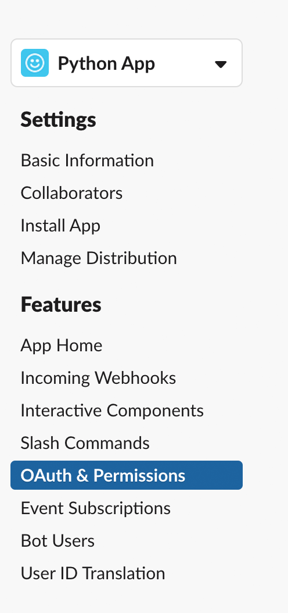
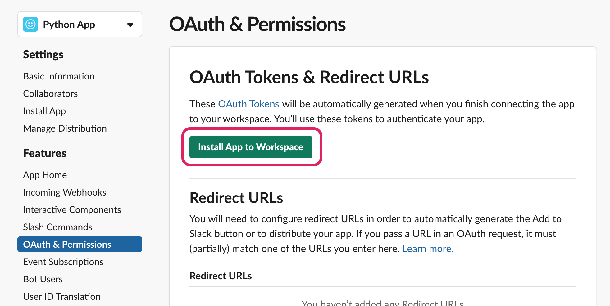
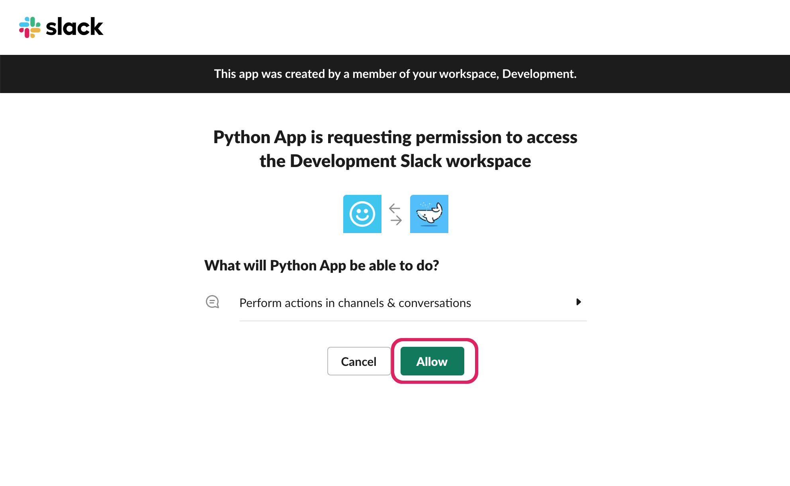
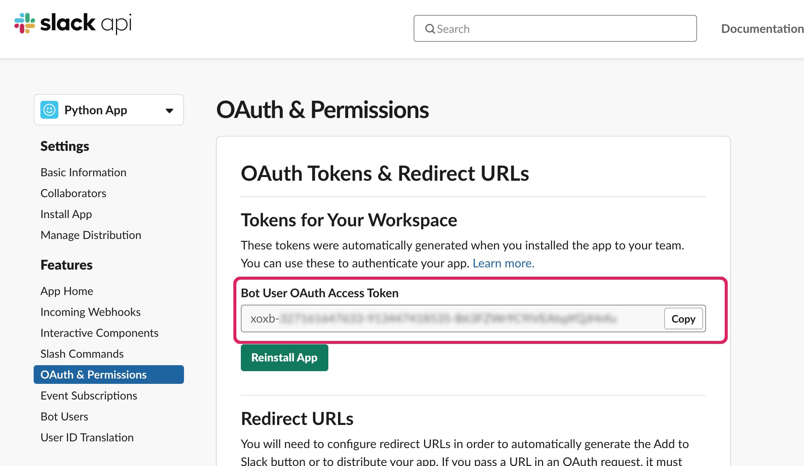

# Create a Slack app

> 💡 Build useful apps, internal tools, simplified workflows, or brilliant bots for just your team or Slack's millions of users.

- To get started, create a new Slack App on [api.slack.com](https://api.slack.com/apps?new_granular_bot_app=1).
  1. Type in your app name.
  2. Select the workspace you'd like to build your app on. We recommend using a workspace where you won't disrupt real work getting done — [you can create one for free](https://slack.com/get-started#create).
     

### Give your app permissions

[Scopes](https://docs.slack.dev/reference/scopes) give your app permission to do things (for example, post messages) in your development workspace.

- Navigate to **OAuth & Permissions** on the sidebar to add scopes to your app

- Scroll down to the **Bot Token Scopes** section and click **Add an OAuth Scope**.

For now, we'll only use one scope.

- Add the [`chat:write` scope](https://docs.slack.dev/reference/scopes/chat.write/) to grant your app the permission to post messages in channels it's a member of.
- Add the [`im:write` scope](https://docs.slack.dev/reference/scopes/im.write/) to grant your app the permission to post messages in DMs.

🎉 You should briefly see a success banner.

_If you want to change your bot user's name, click on **App Home** in the left sidebar and modify the display name._

### Install the app in your workspace

- Scroll up to the top of the **OAuth & Permissions** pages and click the green "Install App to Workspace" button.

Next you'll need to authorize the app for the Bot User permissions.

- Click the "Allow" button.

🏁 Finally copy and save your bot token. You'll need this to communicate with Slack's Platform.

---

**Next section: [02 - Building a message](02-building-a-message.md).**

**Back to the [Table of contents](README.md#table-of-contents).**
